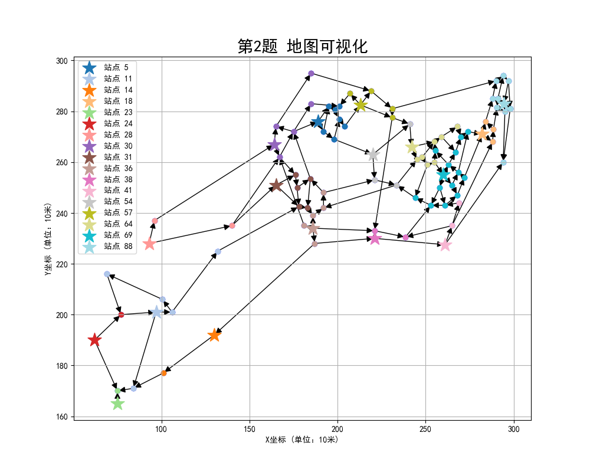

<!-- toc -->

# 摘要

  本文针对鲜奶配送站点的最优化设置问题，建立了**混合整数线性规划模型**，使用Gurobi优化器，基于**分支定界法**和**割平面法**进行求解。为了解决考虑配送速度、配送成本和建设成本等因素，配送时间不超过10分钟，各配送站点配送量均衡等不同要求下的鲜奶配送站点设置优化问题，本文将其转化为一个**选址分配问题（LAP）**。通过对LAP问题的优化求解，实现了对配送站点设置的最优配置。

  对于问题一，本文首先利用**Floyd-Warshall算法**求解任意两点之间的最短路径，为后续优化模型计算配送成本和配送时间提供数据支持。根据问题实际要求和模型假设，以总成本最小化为目标，并以每个节点只由一个站点配送及道路为单向路径为约束条件，建立了。最终，通过求解得到了一个较低成本的鲜奶配送优化方案。

  对于问题二，为满足生鲜产品高时效性的要求，本文在问题一的基础上增加了**配送时间不得超过10分钟**的限制。假设物流车的时速为20km/h，这意味着**配送距离不能超过3.33公里**。基于此限制条件，重新求解模型，得到了符合时间要求的最优配送站点设置方案。

  对于问题三，本文在问题一的基础上，考虑了各配送站点的配送量均衡问题。一个配送站的鲜奶配送量过低会造成资源浪费，而配送量过高则会延误配送。因此，本文引入了**负载均衡约束**，确保各站点的配送量在合理范围内，从而优化了配送效率。通过建立包含负载均衡约束的混合整数线性规划模型，重新求解后得到了最优的配送站点设置方案，保证了资源利用最大化和配送时间的最小化。

  最终，通过**实际数据验证**和**敏感性分析**，本文验证了提出的模型能够有效地降低总成本，提高配送效率，并确保各配送站点的合理布局。

# 问题重述

## 问题背景

鲜奶配送站点的最优化设置问题：生鲜配送与人们的生活息息相关，其中"最后一公里"是物流中的瓶颈环节。特别是鲜奶配送，由于保鲜要求高，必须保证时效性。鲜奶配送站每天早上需要通过非冷链的小型物流车及时将当日的鲜奶配送到各片区网点。因此，合理设置配送站点的位置和数量是牛奶公司面临的实际难题[1]。

## 问题要求

附件中提供了某牛奶公司在某市的92个网点的位置坐标和订奶量，以及网点之间的配送道路数据。基于这些数据，需建立数学模型并分析解决以下问题：

1.  配送成本限制的最优站点设置方案：考虑到鲜奶的保鲜要求，需要尽量缩短配送成本。综合考虑配送速度、配送成本和建设成本等因素，在92个网点位置中选择一个或多个点建设鲜奶配送站。

2.  配送时间限制的最优站点设置方案：假设配送站点到网点的配送时间不得超过10分钟，并且物流车的时速为20km/h，则需要设置多个配送站。考虑到配送站的建设成本，给出最优的配送站点设置方案。

3.  均衡配送量的最优站点设置方案：一个配送站的鲜奶配送量过低会造成资源浪费，过高则会延误配送。考虑各配送站点的配送量均衡问题，重新给出最优的配送站点设置方案。

# 问题分析

某牛奶公司在某市有92个网点，给出了这些网点的位置坐标和订奶量，以及网点之间的配送道路数据。题目要求制定合理的配送站点配置方案，以优化配送效率和降低成本。配送站点的配置受多方面影响，包括牛奶配送的建设成本、配送速度和油耗成本，这些因素对鲜奶公司的盈利情况具有重要影响。此外，鲜奶产品的时效性要求较高，因为该公司采用的是非冷链的小型物流车进行配送，对配送时间提出了严格要求。最后，面对各配送中心配送量不同造成的浪费或延误问题，需要尽可能均衡各配送中心的配送量。因此，选取配送站点位置需要充分考虑成本效益、配送时间和配送均衡性等因素，以制定出最优的方案，从而提升配送效率，降低总成本，保证服务质量和市场竞争力。

## 问题一分析

为了满足公司的盈利需求，需要尽可能减少配送牛奶的总成本。在92个网点中选择一个或多个合适的点来建设鲜奶配送站是解决方案的关键。问题一主要考虑的是成本效益，即在保证产品质量的前提下，如何通过最优化建设配送站点来降低配送成本和建设成本。配送成本主要由油耗和顾客体验损失成本构成，建设成本则是一次性的固定费用，两者都需要在最终的设计方案中进行权衡和优化。此问题的核心在于通过优化配送站点的布局，以最小化总体成本（包括建设成本、油耗成本和顾客体验损失成本），同时保证配送网络的高效运作，从而提升鲜奶配送的服务质量和市场竞争力。

首先，我们从92个网点的位置数据中获取每个网点的需求量和网点间的可达路径距离，利用Floyd-Warshall算法计算得出所有节点对之间的最短路径。接着，我们通过混合整数线性规划（MILP）建模，将建设成本、油耗成本和顾客体验损失成本作为目标函数的组成部分。模型约束条件包括确保每个节点的需求只能由一个站点配送，以及只有建立了站点的节点才能进行配送。通过Gurobi优化器进行求解，利用其强大的分支定界和割平面方法，寻找到最优的配送站点设置方案。最终，根据模型求解结果评估每个选址的经济性和配送效率，为该市鲜奶配送网络的优化提供实质性的指导和建议。

## 问题二分析

为了确保鲜奶在配送过程中保持新鲜，配送时间必须严格控制在10分钟以内。假设物流车的时速为20公里每小时，这意味着每个配送站点到其覆盖的网点的最大距离不能超过3.33公里。基于此时间和距离限制，我们需要在92个网点中选择合适的点来建设一个或多个配送站。同时，依然需要考虑配送站的建设成本、油耗成本和顾客体验损失成本，在保证鲜奶时效性的前提下找到最经济的配送站点布局方案。

为了解决配送时间不超过10分钟的限制，我们首先将起始网点到终止网点超过3.33公里的配送路径设为不可达，然后建立一个混合整数线性规划模型（MILP），定义站点建设和配送的二进制决策变量，通过最小化建设成本、油耗成本和顾客体验损失成本来设定目标函数，并添加约束条件确保每个节点的需求由一个站点配送且路径在3.33公里以内，最终求解模型以获得最优的配送站点设置方案和具体的配送计划。

## 问题三分析

为了满足公司的盈利需求，需要尽可能降低鲜奶配送的总成本。在问题三中，我们需要在92个网点中选择一个或多个适当的位置来建设鲜奶配送站，以优化配送过程中的时间和成本。与问题一不同的是，问题三引入了新的约束条件，特别是配送站点的配送量均衡问题。除了考虑油耗成本和顾客体验损失成本外，还需要确保每个配送站点的配送量在合理范围内，既避免资源浪费又不至于延误配送。因此，问题三的核心在于通过合理的站点布局和配送任务分配，实现成本的最优化，从而提高配送服务的效率和市场竞争力。

为了解决问题三中的配送量均衡问题，我们首先建立了一个线性规划模型。在模型中，我们定义了决策变量来确定哪些位置建设配送站点，并规划每个配送站点的具体配送路线。通过设定约束条件，确保每个网点的需求只由一个配送站点满足，并限制每个配送站点的总配送量在合理的范围内，以避免资源浪费或配送延误。最终，通过优化目标函数，综合考虑建站成本、油费和体验损失成本，我们得出了最优的配送站点设置方案，旨在最小化总成本并确保配送量的均衡分配。

# 模型假设

1.  鲜奶网点间的道路是单向的。

2.  各道路单位距离的配送时间相同

3.  道路距离考虑起始坐标和终点坐标的曼哈顿距离

4.  配送成本和单位距离成正相关

5.  配送成本和订奶量成正相关

6.  配送站建设成本相同

7.  配送车无容量限制

8.  配送车辆次无限制

9.  各站点配送任务间相互独立

# 符号定义

|         符号          |                定义                  |   单位   |
|-----------------------|-------------------------------------|----------|
|    $G = (V, E)$       | 无向图，其中 $V$ 是节点集合，$E$ 是边集合 |          |
|    $n$                | 网点数量                             | 个       |
|    $d_i$              | 节点                                 | 个       |
|    $i$                | 需求量                               | 瓶       |
|    $c_{ij}$           | 从节点 $j$ 到节点 $i$ 的最短路径距离 | 10m      |
| $C_{\text{build}}$    | 站点建设成本                         | 元/个    |
| $C_{\text{oil}}$      | 每公里油耗成本系数                   | 元/10m   |
| $C_{\text{experience}}$ | 每公里顾客体验损失成本系数         | 元/10m   |
|    $x_j$              | 站点 $j$ 是否建立                    |          |
|    $y_{ij}$           | 需求 $i$ 是否由站点 $j$ 配送         |          |
|    $z_j$              | 站点 $j$ 的鲜奶配送量                |          |

# 模型的建立与求解

## 模型准备

要合理设置配送站点的位置和数量，首先要绘制一个展示鲜奶配送网点位置及其之间配送道路的地图。通过该可视化图，我们可以直观地看到网点的地理分布和路径布局，为后续的数学模型的建立和分析提供了直观的基础。


观察到该地图中有一些网点只有出度而没有入度，这意味着这些网点只有通向其他网点的道路，但没有其他网点有道路通向它们。因此这些网点仅能作为起点而不作为终点，必须在此建设鲜奶配送站。

## 问题一

### 最短距离计算

为了查找加权图中所有顶点对之间的最短路径，我们建立了Floyd最短路径模型[2]。Floyd算法基于动态规划，其核心思想是在每一步中考虑一个额外的中间顶点作为可能的路径选择，逐步更新最短路径矩阵。

Floyd-Warshall算法是一种用于计算任意两点之间的最短路径的经典算法，适用于加权有向图或无向图。该算法以动态规划为基础，逐步改进路径估计，最终得出每对顶点之间的最短路径距离。

下面是对Floyd-Warshall算法原理的详细说明:

1.  首先，创建一个距离矩阵 $A$，其中 $A_{ij}$ 表示从顶点 $i$ 到顶点 $j$
    的初始最短路径长度。如果顶点 $i$ 到顶点 $j$ 有直接边，则 $A_{ij}$
    初始化为该边的权重。如果顶点 $i$ 到顶点 $j$ 没有直接边且
    $i \neq j$，则 $A_{ij}$
    初始化为正无穷大。自环（顶点到自身的路径）初始化为 0，即
    $A_{ii} = 0$。

2.  引入中间顶点的概念 $k$，通过逐步考虑每个顶点 $k$
    作为可能的中间点，来更新每对顶点 $i$ 和 $j$ 之间的最短路径。

    状态转移方程为：
    $$ A_{ij}^{k} = \min(A_{ij}^{k-1}, A_{ik}^{k-1} + A_{kj}^{k-1}) $$

    这一过程重复进行，依次将每个顶点作为中间顶点进行上述更新，直到 $k$
    等于总顶点数 $n$。

    

3.  经过所有顶点的逐步更新后，$A_{ij}^{n}$ 即为从顶点 $i$ 到顶点 $j$
    的最短路径长度，其中 $n$ 是顶点的总数。

通过Floyd-Warshall算法计算了每对网点之间的最短路径，适用于确定最短的鲜奶配送路径。可以利用这些最短路径信息来优化配送站点的位置和数量，从而减少配送成本。以下是计算出基于曼哈顿距离的最短距离矩阵：

$$\begin{bmatrix}
                0 & \infty & \infty & \cdots & 58 & 64 & 85 \\
                81 & 0 & 27.5 & \cdots & 131 & 137 & 158 \\
                53.5 & 65.5 & 0 & \cdots & 103.5 & 109.5 & 130.5 \\
                \vdots & \vdots & \vdots & \ddots & \vdots & \vdots & \vdots \\
                \infty & \infty & \infty & \cdots & 0 & 6 & 27 \\
                \infty & \infty & \infty & \cdots & \infty & 0 & 21 \\
                \infty & \infty & \infty & \cdots & \infty & \infty & 0
            \end{bmatrix}_{92 \times 92}$$

可以看到以上矩阵中，对角线上（也就是自环）距离均为零，符合客观事实。其中数字表示行坐标的点到列坐标的点的最短路径距离，距离为无穷的表示不可抵达。

### 混合整数线性规划原理

为了优化鲜奶配送网络，我们建立了一个混合整数线性规划模型。该模型旨在通过合理的站点选址[3]和配送路径规划，最小化总成本，确保鲜奶的高效配送。
混合整数线性规划是一种优化方法，用于解决具有线性目标函数和线性约束条件的问题，其中一些决策变量必须取整数值。它结合了线性规划
(LP) 和整数规划 (IP) 的优点，广泛应用于各种实际问题。

MILP 问题的数学模型可以表示为目标函数和约束条件：

$$\text{Minimize or Maximize} \quad c^T x$$

其中 $c$ 是目标函数系数向量，$x$ 是决策变量向量。

$$\begin{cases}
      x \geq 0 \\
      x_i \in \mathbb{Z}, \quad \forall i \in I
    \end{cases}$$

其中 $A$ 是约束矩阵，$b$ 是约束向量，$I$ 是要求取整数值的变量索引集合。\
**关键步骤:**

1\. 线性规划 ： LP 问题是 MILP 的基础，其中所有变量都是连续的。LP
问题可以通过单纯形法或内点法高效求解。

2\. 整数约束的引入： 在 MILP
中，部分变量必须取整数值，使问题从连续优化变为组合优化。这大大增加了问题的复杂性。

3\. 求解方法：


### 模型建立

(一) 目标函数的确定

为了优化鲜奶配送网络，我们需要最小化总成本，该成本由三部分组成：站点建设成本、油耗成本和顾客体验损失成本。具体来说，目标函数的第一部分
$\sum_{j=1}^{n} C_{\text{build}} x_j$
表示所有配送站点的建设成本；第二部分
$\sum_{i=1}^{n} \sum_{j=1}^{n} (C_{\text{oil}} \cdot c_{ij} \cdot d_i + C_{\text{experience}} \cdot c_{ij}) y_{ij}$
则包含了运输过程中每公里的油耗成本
$(C_{\text{oil}} \cdot c_{ij} \cdot d_i)$ 和顾客体验损失成本
$(C_{\text{experience}} \cdot c_{ij})$。因此，目标函数综合考虑了建站和配送的所有相关成本，力求在满足需求的同时，实现整体成本的最小化。
$$\text{Minimize} \quad \sum_{j=1}^{n} C_{\text{build}} x_j + \sum_{i=1}^{n} \sum_{j=1}^{n} (C_{\text{oil}} \cdot c_{ij} \cdot d_i + C_{\text{experience}} \cdot c_{ij}) y_{ij}$$

(二) 约束条件分析

1\. 每个节点的需求只能由一个站点配送：
$$\sum_{j=1}^{n} y_{ij} = 1, \quad \forall i = 1, 2, \dots, n$$

2\. 只有建立了站点且存在路径的节点才能配送需求：
$$y_{ij} \leq x_j, \quad \text{if } c_{ij} \neq \infty, \quad \forall i = 1, 2, \dots, n, \quad \forall j = 1, 2, \dots, n$$

3\. 如果从节点 $j$ 到节点 $i$ 没有路径，则 $y_{ij}$ 必须等于 0：
$$y_{ij} = 0, \quad \text{if } c_{ij} = \infty$$

(三) 参数的确定

鲜奶配送网络优化问题中，需要合理设置配送站点的位置和数量，以最小化总成本并保证时效性。通过混合整数线性规划模型，我们可以综合考虑站点建设成本、油耗成本和顾客体验损失成本[4]。

1.站点建设成本

设定值：2000

基础设施建设：国内建设一个标准化鲜奶配送站点的成本主要包括土地费用、建筑费用、设备购置费用等。根据各地的物价水平和市场调查，平均到每个周期内1500元左右的建设成本是合理的。

地域差异：全国各地的建设成本可能略有不同，但整体平均建设成本大致在这个范围内浮动。因此，该值具有实际参考意义。

2.油耗成本系数

设定值：0.03

物流车油耗：假设物流车的油耗为每公里消耗一定量的油，在本题中我们考虑物流车每公里消耗3L油。全国平均油价水平计算，每公里的油耗成本大致在该范围内。这考虑了燃油价格的波动性和物流车的燃油效率。

路况影响：全国各地路况差异较大，山区和平原地区的油耗可能有所不同，但平均来看，这个油耗成本系数是合理的。

3.顾客体验损失系数

设定值：20

配送时效性：鲜奶作为生鲜产品，对配送时效性要求极高。延迟配送会导致顾客体验显著下降。设置较高的体验损失系数反映了鲜奶配送过程中顾客对时效性的高期望。

实际需求：中国式现代化中城市化水平和居民生活质量的提升，使得顾客对鲜奶新鲜度的要求越来越高，因此这个体验损失系数较高是符合实际需求的。

综合分析
建模现实性：参数选择基于全国各地的实际情况，包括建设成本、油耗成本和顾客体验损失的实际数据和市场调查，确保模型反映真实世界的情况。
优化目标：通过合理设置这些参数，模型能够在最小化建设成本和运输成本的同时，兼顾顾客的体验损失，达到优化配送网络的目标。
求解效率：这些参数的设定确保了模型在求解过程中能够有效地平衡各项成本，快速收敛到最优解，提升了求解效率和解的质量。
综上所述，这些参数的选择在合理性和现实性方面都经过了充分的考虑和验证，确保了混合整数线性规划模型在优化该市鲜奶配送网络时的有效性和实用性。

(四) 模型的优化

Gurobi 优化器的应用

1.初始化 模型初始化：

使用Gurobi的Python接口（gurobipy）创建一个新的优化模型。
定义变量，包括建设决策变量和配送决策变量，分别为二进制变量，表示是否建立站点和是否选择某路径进行配送。
设置目标函数：

通过Gurobi的建模语法，定义总成本的目标函数。
目标函数包括建设成本、油耗成本和顾客体验损失成本，综合考虑不同路径的距离、需求量及其影响因素。

2.分支定界法 求解初始松弛问题：

求解模型的线性松弛问题，即忽略变量的整数约束。
Gurobi优化器使用其高效的线性规划求解器，快速得到松弛解。
变量分裂与子问题生成：

对于每个非整数的变量，Gurobi自动执行分裂操作，生成新的子问题。
新的子问题分别强制该变量取不同的整数值，形成新的模型。
上下界更新与分支裁剪：

Gurobi通过求解子问题的松弛问题，更新全局的上下界。
裁剪掉那些不可能包含最优解的分支，减少计算量。

3.割平面法 添加割平面：
在求解过程中，Gurobi自动检测并添加有效的线性不等式（割平面），以收缩解空间。
割平面的引入帮助Gurobi更快地逼近整数解。

4.启发式方法 启发式搜索：
Gurobi应用多种启发式算法，快速找到高质量的可行解。
这些启发式方法包括局部搜索、模拟退火等，帮助提升求解速度和解的质量。

5.优化与终止 模型优化：

Gurobi综合利用上述方法，不断迭代求解，更新最优解。
在整个过程中，Gurobi记录和改进可行解，并通过启发式方法和割平面法加速收敛。
终止条件：

当所有子问题都被处理完毕，且没有更优解可供搜索时，Gurobi终止算法。
返回最优整数解，包括建立哪些站点和具体的配送路径。\

Gurobi 优化器的优势

高效性：Gurobi以其高效的算法和优化技术，能够在较短时间内求解大型和复杂的混合整数线性规划问题。

自动化：Gurobi自动处理分支定界、割平面和启发式方法，减少了人工干预，提高了求解过程的自动化水平。

准确性：Gurobi确保求解的准确性和最优性，为优化问题提供了高质量的解。

通过使用Gurobi优化器，该模型能够有效地确定鲜奶配送网络的最优站点设置和配送路径，从而在保证时效性和成本效益的前提下，提高整体配送效率。

### 模型求解

初始化决策变量：

-   建站变量：表示在每个节点是否建立配送站。

-   配送变量：表示每个节点的需求由哪个站点来配送。

构建目标函数 目标函数旨在最小化总成本，包括：

-   建设成本：每个建立的站点的成本。

-   油耗成本：运输过程中油耗成本，根据需求量和最短路径距离计算。

-   顾客体验损失成本：运输过程中由于距离产生的顾客体验损失成本。

添加约束条件 为了确保解的可行性，模型添加了以下约束条件：

-   需求分配约束：每个节点的需求只能由一个站点配送，确保每个节点的需求都能被满足。

-   建站约束：只有在节点建立了站点的情况下，才能进行配送。这保证了只有实际建立了站点的节点才能负责配送。

-   路径约束：如果节点间没有路径，则不能进行配送，确保模型中的配送变量在无路径时为零。

优化过程 模型通过优化器进行求解：

-   目标函数最小化：优化器通过遍历可能的变量组合，找到使目标函数值最小的解。

-   分支定界法：在求解过程中，优化器使用分支定界法对变量进行分裂和裁剪，从而逐步逼近最优解。

-   割平面法：优化器在搜索过程中添加有效的线性不等式（割平面），将解空间逐步缩小到包含整数解的区域。

-   启发式方法：利用启发式方法快速找到高质量的可行解，并进一步改进，以加速求解过程。

提取最优解，优化完成后，模型提取最优的建站和配送方案：

-   选择的配送站点：通过检查建站变量的值，确定哪些节点被选为配送站点。

-   配送计划：通过检查配送变量的值，确定每个节点的需求由哪个站点配送。

-   最终输出包括被选择的配送站点列表和具体的配送计划，以最小化整体成本并满足所有需求。


### 模型结果


图5是在前述的参数设置下实验得到的可视化结果，五角星表示设置为配送中心的网点编号，相同颜色的网点由同一个颜色的配送中心进行配送，构成一个配送区域。其中，由于存在无入度的孤立点，这些孤立点不能由任一节点到达，因而必须被设置为配送中心网点。在该图中可见，例如编号为23、24、28和36的网点都是这样的孤立点，它们也都被正确设置成为了配送中心，侧面印证了我们算法约束条件以及最终结果的正确性。

|      项目       |    成本   |
|-----------------|-----------|
| 建站成本        | 34500.06  |
| 油费            | 4428.15   |
| 体验损失成本    | 22190.08  |
| 总成本          | 61118.15  |


## 问题二

### 矩阵预处理

第二问要求在考虑每个配送站点到网点的最大配送时间不超过10分钟的情况下[5]，设计最优的配送站点设置方案。首先，根据题目要求，我们需要将原始的距离矩阵根据物流车辆的时速（20km/h）转换成最大配送距离。

$$s = vt$$

根据距离速度公式，计算可得最大配送距离为333.33米，这个步骤保证了任何两个站点之间的最短路径超过这个阈值将被视为不可行路径，从而限制了每个配送站点的最大服务范围。

### 模型建立

(一) 数据预处理

首先处理最短路径距离矩阵，将所有超过配送时间限制的路径设为无穷大，以确保这些路径不会被选用。假设配送时间限制为10分钟，物流车的时速为20公里每小时，对应的最大距离约为3.33公里。

(二) 添加约束条件

在第二问中，我们在第一问的基础上增加了配送时间不得超过10分钟的限制条件。具体而言，我们假设物流车的时速为20公里/小时，将最远配送距离设为3333.33米，对距离超过这个值的路径进行剔除，使得配送时间满足限制。这样，新增的约束条件进一步细化了模型，确保了每个网点的配送站点都能在规定时间内完成配送，优化了站点布局和资源配置。

### 模型求解

前半部分与问题一建模相同，修改距离矩阵之后重新使用优化器求解上述建立的线性规划模型，优化器使用混合整数线性规划的基本原理，包括初始化、分支定界法、割平面法和启发式方法，获取最优解。根据求解结果，计算并输出总成本，包括建站成本、油耗成本和顾客体验损失成本。根据求解结果，确定被选中的配送站点及其对应的配送计划。


### 模型结果



由图7可视化结果可以看到，问题一和问题二的站点设置结果几乎一样，主要是由于优化目标和约束条件的相似性。虽然问题二增加了配送时间不得超过10分钟的约束，但如果问题一中的最优解已经在每个网点附近合理设置了配送站点，并且这些站点都能在10分钟内覆盖其服务的网点，那么时间约束不会对结果产生显著影响。此外，数据的分布和最优解的鲁棒性可能使得问题一中的解决方案已经充分满足了问题二的要求，因此两者的站点设置结果一致。

|      项目       |    成本   |
|-----------------|-----------|
| 建站成本        | 34500.06  |
| 油费            | 4428.15   |
| 体验损失成本    | 22190.08  |
| 总成本          | 61118.15  |


## 问题三

### 模型建立

(一) 决策变量的引入

在第三问中，与前两问相比，我们引入了额外的约束和决策变量，以解决配送站点的配送量均衡问题，避免资源浪费和配送延误。以下是添加后的决策变量：

-   建站决策变量 $x_i$：表示是否在网点 $i$
    处建立配送站点。这与前两问相同，目的是最小化建站成本。

-   配送决策变量 $y_{ij}$：表示是否从配送站点 $i$ 配送到网点
    $j$。同样地，这也是前两问的核心决策变量，用于优化配送路径和成本。

-   站点总配送量决策变量 $z_j$：连续变量，表示站点 $j$
    的总配送量。这是第三问中新增的决策变量，用于确保每个配送站点的配送负载在合理范围内，避免过低或过高的配送量。

(二) 配送量均衡的约束

在第三问中，我们新增了三个约束条件以解决配送站点的配送量均衡问题，其中总配送量约束确保每个站点的总配送量等于其服务的所有网点的需求之和，从而保证了配送任务的完整性和正确性。负载平衡约束则确保了各配送站点的配送负载在一个合理的范围内，避免了某些站点负载过重导致资源浪费，或者负载过轻导致配送效率低下的问题。这种平衡性可以在实际操作中提高配送的稳定性和效率，同时降低整体的运营成本。通过新增的约束条件，我们在优化建站成本、配送成本的同时，有效地解决了配送站点的配送量均衡问题，使得最终的配送方案更加合理和高效。以下是详细说明：

-   总配送量约束：确保站点 $j$
    的总配送量等于其服务的所有网点的需求之和。
    $$z_j = \sum_{i} \text{demand}_i \times y_{ij} $$

-   负载平衡约束：计算出总需求的平均值，并设置每个站点的最大和最小配送负载范围。其中
    $\text{max\_load}$ 和 $\text{min\_load}$
    分别是总需求的均值加减一个容差范围，以确保每个配送站点的负载平衡。此外只有在该网点被设置成配送中心时才会受此约束。
    $$\begin{cases}
        z_j \leq \text{max\_load} \times x_j \\
        z_j \geq \text{min\_load} \times x_j
        \end{cases}$$

### 模型求解

问题三与问题一二的求解流程方法相同，主要区别在于引入了配送量均衡的约束条件，这使得其更加综合和现实，能够更好地反映实际配送过程中的复杂性和资源利用效率的重要性。这使得问题三的解决方案更具有实际应用的指导意义，能够更好地优化配送网络的布局和运作。以下是主要区别：

. 配送量均衡约束：

问题三：要求每个配送站点的总配送量应该尽可能均衡，以避免资源浪费和配送延误。这意味着不能简单地选择最少数量的站点或根据时间限制建站，还需考虑每个站点的配送负载均衡。

问题一：只考虑建立若干数量的配送站点以覆盖所有网点，目标是最小化建站成本，没有考虑到各站点之间的配送量均衡。

问题二：引入了时间限制，要求配送时间不超过一定的限制，考虑到物流效率和配送成本，但同样没有考虑到配送量均衡。

. 模型复杂度：

问题三：由于引入了配送量均衡的约束条件，模型设计更加复杂，需要在保证经济性的同时，寻找使每个配送站点负载尽可能均衡的最优解。

问题一二：相对而言，模型设计相对简单，问题一着重于建站成本的最小化，问题二在此基础上加入了时间限制的考虑。

. 优化目标的综合性：

问题三：目标函数综合考虑了建站成本、配送成本和配送时间成本的影响，需要在多个因素之间进行权衡和优化。

问题一二：目标函数相对单一，问题一以建站成本最小化为主，问题二加入了时间成本的考虑，但仍相对单一。


### 模型结果


由图9和图10的可视化结果可以看出，相较于问题一和问题二，选取的配送站点分布更加均匀，避免了单个站点负载过高或过低的情况。这使得配送站的设置既考虑了成本和配送时间，又保证了各站点的合理使用，提升了整体配送效率和资源利用率。

通过这种均衡的站点分布，可以显著降低单一站点的过度负担，减少因负载不均衡而导致的潜在问题，如配送延迟或站点资源浪费。这种方法不仅优化了配送路径和成本，还提升了系统的整体稳定性和可靠性。


# 模型检验

## 敏感性分析

在模型中，油耗成本系数直接影响配送的油费部分。我们分别对油耗成本系数取不同值进行分析，观察总成本的变化情况。为了验证模型的鲁棒性和适应性，我们进行了敏感性分析，重点考察了目标成本在不同油耗成本系数（从0到0.5）和建站成本（从0到30000）下的变化。以下是具体分析内容：

1. 低油耗成本系数（接近0）：在油耗成本极低的情况下，总成本中油费部分几乎可以忽略，但由于建站成本和体验损失成本的影响，整体总成本可能变化不大。结果显示，总成本较低，配送站点的分布略有变化，但仍集中于需求量较高的区域。

2. 中等油耗成本系数（0.25左右）：在中等油耗成本情况下，总成本中油费部分占一定比例，配送站点的设置较为均衡，既考虑了建站成本，也兼顾了配送距离和时间。

3. 高油耗成本系数（接近0.5）：在油耗成本较高的情况下，总成本中油费部分显著增加，导致整体总成本上升。为了减少油费，总体配送距离减少，配送站点更多地分布在需求密集区，但可能导致某些站点的负载增加。

建站成本对模型中的站点建设决策有直接影响。我们对建站成本取不同值进行分析，观察总成本的变化情况。

1. 低建站成本（接近0）：在建站成本极低的情况下，更容易建设多个配送站点，从而减少配送距离和油费，提升配送效率。
结果显示，总成本有所降低，配送站点的数量增加，分布更加均匀，但每个站点的负载相对较小。

2. 中等建站成本（15000左右）：在中等建站成本情况下，总成本中建站费用占一定比例，配送站点设置较为合理，既控制了站点数量，又保证了配送效率。

3. 高建站成本（接近30000）：在建站成本较高的情况下，为了节省建站费用，总体站点数量减少，导致某些站点的负载增加，配送距离和油费上升。总成本显著增加，配送站点主要集中在需求量大的区域，某些较远区域的配送时间和费用增加。


通过对油耗成本系数和建站成本的敏感性分析，可以看出油耗成本系数对总成本中的油费部分有显著影响，油耗成本越高，总成本越大，配送站点分布更集中于需求密集区域。建站成本对总成本中的站点建设费用有显著影响，建站成本越高，总成本越大，配送站点数量减少，负载增加。在实际应用中，需要根据具体情况调整油耗成本系数和建站成本，找到最优的配送站点设置方案，既要控制总成本，又要确保配送效率和顾客体验。

## 配送量均衡性对比


Data1是未经均衡约束的各站点配送量数据，Data3是经过了最大最小均衡性约束后得到的各站点配送量数据。

在图12中可以看到，Data 1（以浅蓝色表示）值的范围从约 270 到1570。数据值逐渐递增，数据集显得分布不均衡。部分数据值远高于其他值，例如最大值为1570，与其他数据相比显得特别突出。Data 3\*\*（以橙色表示）值的范围从 240到400。数据值较为均匀，波动范围较小。所有数据值都在相对接近的范围内，没有特别突出的高值或低值。

Data 3的方法显然比Data1更卓越有效，因为它提供了一个均衡的数据分布，这有助于提升系统的稳定性和可靠性。使得任何一个数据点不会过于突出，避免了极端值对系统的影响。均衡的数据分布也意味着未来的趋势和变化可以更容易地预测和管理。

# 模型评价

## 模型优点

1. 综合考虑多个因素：模型综合考虑了配送成本、建设成本、和配送时间等多个因素，使得解决方案更加全面和实际。

2. 多目标优化：在设计过程中，考虑了不同的优化目标，例如最小化总成本和均衡配送量，确保了模型的灵活性和适用性。

3. 均衡配送量：在问题三中，模型引入了各配送站点的配送量均衡约束，避免了资源浪费和延误问题，提升了整体物流效率。

4. 可视化验证：通过可视化结果，模型的正确性和合理性得到了验证，直观地展示了各站点的分布和服务区域。

## 模型缺点

1. 数据依赖性强：模型对输入数据的准确性和完整性依赖较强，如果数据不准确或不完整，可能会影响最终的结果。

2. 计算复杂度高：随着网点数量的增加，模型的计算复杂度也会显著增加，可能导致求解时间较长，不适用于大规模问题。

3. 静态优化：模型基于静态数据进行优化，未考虑到实际运营过程中可能出现的动态变化，如需求波动、道路堵塞等。

## 模型改进

1. 引入动态优化：可以引入动态优化算法，考虑实时数据和变化，以提升模型在实际应用中的适应性和灵活性。
 
2. 增强数据预处理：增强数据预处理步骤，确保输入数据的准确性和完整性，以提高模型的可靠性。

3. 优化算法选择：针对大规模问题，可以考虑使用启发式算法或元启发式算法（如遗传算法、粒子群优化等）来提高求解效率。

4. 考虑更多约束：可以引入更多实际约束条件，如配送车辆容量限制、时间窗口等，以提升模型的实际应用效果。

## 模型推广

1. 其他配送场景：模型可以推广应用于其他类型的配送场景，如快递、餐饮外卖等，只需根据具体需求调整相关参数和约束条件。

2. 供应链优化：该模型可以作为供应链优化的一部分，结合库存管理、运输调度等模块，形成完整的供应链优化方案。

3. 智能城市规划：在智能城市规划中，可以利用该模型进行物流站点布局优化，提高城市物流效率，减少交通拥堵和环境污染。

# 参考文献

1. 袁昊,苏凯凯,滕泽慧,等.基于双层规划的配送中心选址及路径优化方法研究\[J\].物流工程与管理,2023,45(10):38-42.
2. Cormen, Thomas H., Charles E. Leiserson, Ronald L. Rivest, and Clifford Stein.*Introduction to Algorithms*. 3rd ed. Cambridge, MA: MIT Press,1.    ISBN 978-0-262-03384-8.
3. Farahani, R. Z., SteadieSeifi, M., & Asgari, N. (2010). Multiple
criteria facility location problems: A survey. Applied Mathematical
Modelling, 34(7), 1689-1709.
4. 徐梦月.一鸣鲜奶连锁公司配送路径优化研究\[D\].安徽理工大学,2022.DOI:10.26918/d.cnki.ghngc.2022.001062.
5. 李冰,党佳俊.多配送中心下生鲜农产品同步取送选址-路径优化\[J\].智能系统学报,2020,15(01):50-58.

# 附录

## 读取文件 --python 源程序

``` {.python language="python"}
def read_data(file_path):
    point_df = pd.read_excel(file_path, sheet_name=0, header=0)
    route_df = pd.read_excel(file_path, sheet_name=1, header=0)
    return point_df, route_df
```

## 计算弗洛伊德矩阵 --python 源程序

``` {.python language="python"}
def compute_distance_matrix(point_df):
    coordinates = point_df[['鲜奶网点的横坐标X', '鲜奶网点的纵坐标Y']].values
    distance_matrix = cdist(coordinates, coordinates, metric='cityblock')
    return distance_matrix

def compute_path_matrix(point_df, route_df):
    num_points = len(point_df)
    path_matrix = np.zeros((num_points, num_points))
    for _, row in route_df.iterrows():
        start_idx = row['道路起点(网点）编号'] - 1  # 调整为0开始索引
        end_idx = row['道路终点（网点）编号'] - 1  # 调整为0开始索引
        path_matrix[start_idx, end_idx] = 1
    return path_matrix.astype(int)

def floyd_warshall(distance_matrix, path_matrix):
    num_points = len(distance_matrix)
    shortest_path_matrix = np.full((num_points, num_points), np.inf)
    for i in range(num_points):
        for j in range(num_points):
            if path_matrix[i, j] == 1:
                shortest_path_matrix[i, j] = distance_matrix[i, j]
            if i == j:
                shortest_path_matrix[i, j] = 0
    for k in range(num_points):
        for i in range(num_points):
            for j in range(num_points):
                if shortest_path_matrix[i, j] > shortest_path_matrix[i, k] + shortest_path_matrix[k, j]:
                    shortest_path_matrix[i, j] = shortest_path_matrix[i, k] + shortest_path_matrix[k, j]
    return shortest_path_matrix
```

## MILP建模求解 --python 源程序

 

``` {.python language="python"}
def solve_milp_gurobi(point_df, shortest_path_matrix, build_cost, oil_cost_coef, experience_loss_coef):
    num_points = len(point_df)
    demand = point_df['订奶量(瓶)'].values

    model = Model("LogisticsOptimization")

    # 变量
    x = model.addVars(num_points, vtype=GRB.BINARY, name="x")  # 建站决策变量
    y = model.addVars(num_points, num_points, vtype=GRB.BINARY, name="y")  # 配送决策变量
    z = model.addVars(num_points, vtype=GRB.CONTINUOUS, lb=0, name="z")  # 各站点总配送量

    # 目标函数
    objective = build_cost * sum(x[i] for i in range(num_points))  # 使用单一的 build_cost

    for i in range(num_points):
        for j in range(num_points):
            if not np.isinf(shortest_path_matrix[j][i]):
                objective += oil_cost_coef * shortest_path_matrix[j][i] * demand[i] * y[i, j]
                objective += experience_loss_coef * shortest_path_matrix[j][i] * y[i, j]
    model.setObjective(objective, GRB.MINIMIZE)

    # 约束
    for i in range(num_points):
        model.addConstr(sum(y[i, j] for j in range(num_points)) == 1)  # 每个节点的货物只能由一个站点配送

    for i in range(num_points):
        for j in range(num_points):
            if not np.isinf(shortest_path_matrix[j][i]):
                # 如果y[i][j]等于1，则要求x[j]必须等于1
                model.addConstr(y[i, j] <= x[j])
            else:
                # 如果从节点j到节点i不存在路径（即 shortest_path_matrix[j][i] 为无穷大），则y[i][j]必须等于0
                model.addConstr(y[i, j] == 0)

    # 计算各站点的总配送量
    for j in range(num_points):
        model.addConstr(z[j] == sum(demand[i] * y[i, j] for i in range(num_points)))

    # 平衡各站点的负载
    total_demand = sum(demand)
    max_load = total_demand / num_points + 2 * total_demand / num_points
    min_load = total_demand / num_points - 2 * total_demand / num_points

    for j in range(num_points):
        model.addConstr(z[j] <= max_load * x[j])
        model.addConstr(z[j] >= min_load * x[j])

    # 求解模型
    model.optimize()

    selected_stations = [i + 1 for i in range(num_points) if x[i].x > 0.5]
    delivery_plan = [(i + 1, j + 1) for i in range(num_points) for j in range(num_points) if y[i, j].x > 0.5]

    # 计算和输出成本
    build_cost_value = sum(build_cost * x[i].x for i in range(num_points))
    oil_cost_value = sum(oil_cost_coef * shortest_path_matrix[j][i] * demand[i] * y[i, j].x for i in range(num_points) for j in range(num_points) if not np.isinf(shortest_path_matrix[j][i]))
    experience_loss_cost_value = sum(experience_loss_coef * shortest_path_matrix[j][i] * y[i, j].x for i in range(num_points) for j in range(num_points) if not np.isinf(shortest_path_matrix[j][i]))

    total_cost = build_cost_value + oil_cost_value + experience_loss_cost_value

    print(f"建站成本: {build_cost_value}")
    print(f"油费: {oil_cost_value}")
    print(f"体验损失成本: {experience_loss_cost_value}")
    print(f"总成本: {total_cost}")

    # 打印各中心的配送量
    delivery_volumes = []
    delivery_indices = []
    for j in range(num_points):
        if z[j].x > 0:
            print(f"中心 {j+1} 的配送量: {z[j].x}")
            delivery_volumes.append(z[j].x)
            delivery_indices.append(j + 1)  # 保存索引值

    return selected_stations, delivery_plan
```

## 配送方案可视化 --python 源程序

 

``` {.python language="python"}
def visualize(point_df, route_df, selected_stations, delivery_plan, cnt):
    set_chinese_font()

    colors = plt.cm.tab20(np.linspace(0, 1, len(selected_stations)))

    plt.figure(figsize=(10, 8))

    plt.scatter(point_df['鲜奶网点的横坐标X'], point_df['鲜奶网点的纵坐标Y'], c='blue', marker='o')

    # 绘制路径并添加箭头
    for _, row in route_df.iterrows():
        start_point = point_df[point_df['鲜奶网点编号'] == row['道路起点(网点）编号']]
        end_point = point_df[point_df['鲜奶网点编号'] == row['道路终点（网点）编号']]
        arrow = FancyArrowPatch(
            (start_point['鲜奶网点的横坐标X'].values[0], start_point['鲜奶网点的纵坐标Y'].values[0]),
            (end_point['鲜奶网点的横坐标X'].values[0], end_point['鲜奶网点的纵坐标Y'].values[0]),
            mutation_scale=15,
            color='black',
            arrowstyle='-|>',
            linewidth=1
        )
        plt.gca().add_patch(arrow)

    for idx, station in enumerate(selected_stations):
        station_idx = station - 1
        color = colors[idx]
        plt.scatter(point_df.loc[station_idx, '鲜奶网点的横坐标X'], point_df.loc[station_idx, '鲜奶网点的纵坐标Y'],
                    color=color, marker='*', s=300, zorder=5, label=f'站点 {station}')
        for delivery in delivery_plan:
            if delivery[1] == station:
                delivery_idx = delivery[0] - 1
                plt.scatter(point_df.loc[delivery_idx, '鲜奶网点的横坐标X'], point_df.loc[delivery_idx, '鲜奶网点的纵坐标Y'],
                            color=color, marker='o')

    plt.xlabel('X坐标 (单位：10米)')
    plt.ylabel('Y坐标 (单位：10米)')
    plt.title(f'第{cnt}题 地图可视化', fontsize=20)
    plt.grid(True)
    plt.legend()
    plt.show()
```
