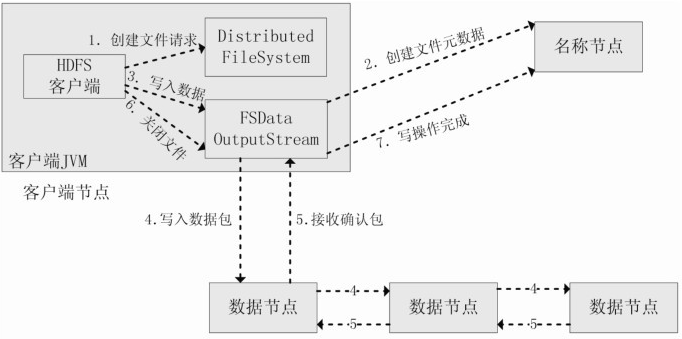

<!-- toc -->

# 第一篇 大数据基础

## 第1章 大数据概述

本篇介绍大数据（Big Data）的基本概念、影响和应用领域，并阐述大数据与云计算、物联网的相互关系，还介绍大数据处理架构Hadoop。由于Hadoop已经成为应用最广泛的大数据技术的处理架构，因此本书的大数据相关技术主要围绕Hadoop展开，包括Hadoop、MapReduce、HDFS和HBase等。本篇内容是学习后续内容的基础。

本篇包括2章。第1章介绍大数据的概念和应用，分析大数据、云计算和物联网的相互关系等；第2章介绍大数据处理架构Hadoop。
### 1.1 大数据时代

### 1.2 大数据的概念

- 数据量大
- 数据类型繁多
- 处理速度快
- 信息密度低

### 1.3 大数据的影响

#### 1.3.1 大数据对科学研究的影响

1. 实验科学
2. 理论科学
3. 计算科学
4. 数据密集型科学

#### 1.3.2 大数据对思维方式的影响

1. 全样而非抽样
2. 效率而非精确
3. 相关而非因果

### 1.4 大数据的应用

### 1.5 大数据关键技术

- 数据采集与预处理
- 数据存储和管理
- 数据处理与分析
- 数据安全和隐私保护

### 1.6 大数据计算模式

- 批处理计算
- 流计算
- 图计算
- 查询分析计算

### 1.7 大数据产业

### 1.8 大数据与云计算、物联网

- 云计算为大数据提供了**技术基础**，大数据为云计算机提供**用武之地**。
- 物联网是大数据的**重要来源**，大数据技术为物联网数据分析**提供支撑**。
- 云计算为物联网**提供海量数据存储能力**，物联网为云计算技术**提供了广阔的应用空间**。

### 1.9 本章小结

本章介绍了大数据技术的发展历程，并指出信息科技的不断进步为大数据时代提供了技术支撑，数据产生方式的变革促成了大数据时代的来临。

大数据具有数据量大、数据类型繁多、处理速度快、价值密度低等特点，统称“4V”。大数据对科学研究、思维方式、社会发展、就业市场和人才培养等方面都产生了重要的影响，深刻理解大数据的这些影响，有助于我们更好地把握学习和应用大数据的方向。

大数据在制造、金融、汽车、互联网、餐饮、电信、能源、物流、城市管理、生物医学、体育和娱乐等在内的社会各个行业/领域都得到了广泛的应用，深刻地改变着我们的社会生产和日常生活。

大数据并非单一的数据或技术，而是数据和大数据技术的综合体。大数据技术主要包括数据采集、数据存储和管理、数据处理与分析、数据安全和隐私保护等几个层面的内容。

大数据产业包括IT基础设施层、数据源层、数据管理层、数据分析层、数据平台层和数据应用层，在不同层面都已经形成了一批引领市场的技术和企业。

本章最后介绍了云计算和物联网的概念和关键技术，并阐述了大数据、云计算和物联网三者之间的区别与联系。

## 第2章 大数据处理架构Hadoop

### 2.1 概述

Hadoop的特性：
- 高可靠性（冗余数据存储）
- 高效性（分布式存储和分布式处理）
- 高可扩展性（高效稳定运行在廉价的计算机集群上）
- 高容错性（冗余数据存储）
- 成本低（廉价的计算机集群）
- 运行在Linux平台上（基于Java开发，较好地运行在Linux）
- 支持多种编程语言

### 2.2 Hadoop生态系统

- HDFS
- HBase
- MapReduce
- Hive
- Pig
- Mahout
- Zookeeper
- Flume
- Sqoop
- Ambari

### 2.3 Hadoop的安装与使用

### 2.4 本章小结

Hadoop被视为事实上的大数据处理标准，本章介绍了Hadoop的发展历程，并阐述了Hadoop的**高可靠性、高效性、高可扩展性、高容错性、成本低、运行在Linux操作系统上、支持多种编程语言**等特性。

Hadoop目前已经在各个领域得到了广泛的应用，如雅虎、百度、淘宝、网易等公司都建立了自己的Hadoop集群。

经过多年发展，Hadoop生态系统已经变得非常成熟和完善，包括ZooKeeper、HDFS、HBase、MapReduce、Hive、Pig等子项目，其中HDFS和MapReduce是Hadoop的两大核心组件。

本章最后介绍了如何在 Linux 操作系统下完成Hadoop 的安装和使用，该部分是后续实践环节的基础。

# 第二篇 大数据存储与管理

本篇介绍大数据存储与管理相关技术的概念与原理，包括Hadoop分布式文件系统（HDFS）、分布式数据库（HBase）、NoSQL数据库和云数据库。HDFS提供了在廉价服务器集群中进行大规模分布式文件存储的能力。HBase是一个高可靠、高性能、面向列、可伸缩的分布式数据库，主要用来存储非结构化和半结构化的松散数据。NoSQL数据库可以支持超大规模数据存储，灵活的数据模型可以很好地支持Web 2.0应用，具有强大的横向扩展能力，可以有效弥补传统关系数据库的不足。云数据库是部署在云计算环境中的虚拟化数据库，可以将用户从烦琐的数据库硬件定制中解放出来，同时让用户拥有强大的数据库扩展能力，满足不同类型用户的数据存储需求。需要特别指出的是，虽然云数据库在概念上更偏向于云计算的范畴，但是云计算和大数据是密不可分的两种技术，不能割裂看待，而且了解云数据库有助于拓展对大数据存储和管理方式的认识，因此本篇内容介绍了云数据库的概念和相关产品。

本篇包括4章。第3章介绍分布式文件系统HDFS，第4章介绍分布式数据库HBase，第5章介绍NoSQL数据库，第6章介绍云数据库。

## 第3章 分布式文件系统 HDFS

### 3.1 分布式文件系统

#### 3.1.1 计算机集群结构

集群中的计算机节点放在机架上，通过网络互连，不同机架间采用另一极网络或交换机互联。

#### 3.1.2 分布式文件系统的结构

分布式文件系统也采用了**块的概念**，文件被分成若干个块进行存储，块是数据读写的基本单元。HDFS默认的一个块的大小是64 MB。在分布式文件系统中，如果一个文件小于一个数据块的大小，它并不占用整个数据块的存储空间。

分布式文件系统在物理结构上是由计算机集群中的多个节点构成的。这些节点分为两类：一类叫“**主节点**”（Master Node），或者也被称为“名称节点”（NameNode）；另一类叫“**从节点**”（Slave Node），或者也被称为“数据节点”（DataNode）。

- 名称节点负责文件和目录的创建、删除和重命名等，同时管理着数据节点和文件块的映射关系，因此客户端只有访问名称节点才能找到请求的文件块所在的位置，进而到相应位置读取所需文件块。
- 数据节点负责数据的存储和读取，在存储时，由名称节点分配存储位置，然后由客户端把数据直接写入相应数据节点；在读取时，客户端从名称节点获得数据节点和文件块的映射关系，然后就可以到相应位置访问文件块。数据节点也要根据名称节点的命令创建、删除数据块和冗余复制。

计算机集群采用**多副本存储。**

### 3.1.3 分布式系统设计需求

- 透明性
- 并发控制
- 文件复制
- 硬件和操作系统的异构性
- 可伸缩性
- 容错
- 安全

### 3.2 HDFS简介

HDFS需**实现以下目标**：
- 兼容廉价的硬件设备
- 流数据读写
- 大数据集
- 简单的文件模型
- 强大的跨平台兼容性

HDFS的**应用局限性**：
- 不适合低延迟数据访问
- 无法高效存储大量小文件
- 不支持多用户写入及任意修改文件

### 3.3 HDFS的相关概念

#### 3.3.1 块

HDFS默认一个块64MB，以最小化寻址开销。设计较大的块可以降低单位数据的寻址开销，但是过大的块又会降低作业并行速度。

块概念**优点**：
- 支持大规模文件存储
- 简化系统设计
- 适合数据备份

#### 3.3.2 名称节点和数据节点

 HDFS 中，**名称节点**（NameNode）负责管理分布式文件系统的命名空间（Namespace），保存了两个核心的数据结构（见图3-3），即FsImage和EditLog。FsImage用于维护文件系统树以及文件树中所有的文件和文件夹的元数据，操作日志文件EditLog中记录了所有针对文件的创建、删除、重命名等操作。名称节点记录了每个文件中各个块所在的数据节点的位置信息，但是并不持久化存储这些信息，而是在系统每次启动时扫描所有数据节点重构得到这些信息。

名称节点在启动时，会将 FsImage 的内容加载到内存当中，然后执行 EditLog 文件中的各项操作，使得内存中的元数据保持最新。这个操作完成以后，就会创建一个新的 FsImage 文件和一个空的EditLog文件。名称节点启动成功并进入正常运行状态以后，HDFS中的更新操作都会被写入到 EditLog，而不是直接写入FsImage，这是因为对于分布式文件系统而言，FsImage文件通常都很庞大（一般都是GB级别以上），如果所有的更新操作都直接往FsImage文件中添加，那么系统就会变得非常缓慢。相对而言，EditLog通常都要远远小于FsImage，更新操作写入到EditLog是非常高效的。名称节点在启动的过程中处于“安全模式”，只能对外提供读操作，无法提供写操作。启动过程结束后，系统就会退出安全模式，进入正常运行状态，对外提供读写操作。

**数据节点**（DataNode）是分布式文件系统HDFS的工作节点，负责数据的存储和读取，会根据客户端或者名称节点的调度来进行数据的存储和检索，并且向名称节点定期发送自己所存储的块的列表。每个数据节点中的数据会被保存在各自节点的本地Linux文件系统中。

#### 3.3.3 第二名称节点

为了有效解决EditLog逐渐变大带来的问题，HDFS在设计中采用了第二名称节点（Secondary NameNode）。第二名称节点是HDFS架构的一个重要组成部分，具有两个方面的功能：首先，可以完成EditLog与FsImage的**合并操作**，减小EditLog文件大小，缩短名称节点重启时间；其次，可以作为名称节点的“**检查点**”，保存名称节点中的元数据信息。

### 3.4 HDFS体系结构

#### 3.4.1 概述

HDFS采用了**主从（Master/Slave）结构模型**，一个HDFS集群包括一个名称节点和若干个数据节点（见图3-5）。名称节点作为中心服务器，负责管理文件系统的命名空间及客户端对文件的访问。集群中的数据节点一般是一个节点运行一个数据节点进程，负责处理文件系统客户端的读/写请求，在名称节点的统一调度下进行数据块的创建、删除和复制等操作。每个数据节点的数据实际上是保存在本地Linux文件系统中的。每个数据节点会周期性地向名称节点发送“心跳”信息，报告自己的状态，没有按时发送心跳信息的数据节点会被标记为“宕机”，不会再给它分配任何I/O请求。

用户在使用HDFS时，仍然可以像在普通文件系统中那样，使用文件名去存储和访问文件。实际上，在系统内部，一个文件会被切分成若干个数据块，这些数据块被分布存储到若干个数据节点上。当客户端需要访问一个文件时，首先把文件名发送给名称节点，名称节点根据文件名找到对应的数据块（一个文件可能包括多个数据块），再根据每个数据块信息找到实际存储各个数据块的数据节点的位置，并把数据节点位置发送给客户端，最后客户端直接访问这些数据节点获取数据。在整个访问过程中，**名称节点并不参与数据的传输**。这种设计方式，使得一个文件的数据能够在不同的数据节点上实现并发访问，大大提高了数据访问速度。

HDFS采用**Java语言**开发，因此任何支持JVM的机器都可以部署名称节点和数据节点。HDFS 集群中只有唯一一个名称节点，该节点负责所有元数据的管理，这种设计大大简化了分布式文件系统的结构，可以保证数据不会脱离名称节点的控制，同时，用户数据也永远不会经过名称节点，这大大减轻了中心服务器的负担，方便了数据管理。

#### 3.4.2 HDFS命名空间管理

HDFS的命名空间包含目录、文件和块。命名空间管理是指命名空间支持对HDFS中的目录、文件和块做类似文件系统的创建、修改、删除等基本操作。在当前的HDFS体系结构中，在整个HDFS 集群中只有**一个命名空间**，并且只有**唯一一个名称节点**，该节点负责对这个命名空间进行管理。、

#### 3.4.3 通信协议

HDFS是一个部署在集群上的分布式文件系统，因此很多数据需要通过网络进行传输。所有的HDFS通信协议都是构建在TCP/IP协议基础之上的。客户端通过一个可配置的端口向名称节点主动发起TCP连接，并使用客户端协议与名称节点进行交互。名称节点和数据节点之间则使用数据节点协议进行交互。客户端与数据节点的交互是通过 RPC（Remote Procedure Call）来实现的。在设计上，**名称节点不会主动发起RPC**，而是响应来自客户端和数据节点的RPC请求。

#### 3.4.4 客户端

- 命令行
- Java API

#### 3.4.5 HDFS体系结构的局限性

HDFS 只设置唯一一个名称节点，这样做虽然大大简化了系统设计，但也带来了一些明显的局限性，具体如下。

1. 命名空间的限制。名称节点是保存在内存中的，因此名称节点能够容纳对象（文件、块）的个数会受到内存空间大小的限制。
2. 性能的瓶颈。整个分布式文件系统的吞吐量受限于单个名称节点的吞吐量。
3. 隔离问题。由于集群中只有一个名称节点，只有一个命名空间，因此无法对不同应用程序进行隔离。
4. 集群的可用性。一旦这个唯一的名称节点发生故障，会导致整个集群变得不可用。

### 3.5 HDFS的存储原理

#### 3.5.1 数据的冗余存储

1. **加快数据传输速度**。当多个客户端需要同时访问同一个文件时，可以让各个客户端分别从不同的数据块副本中读取数据，这就大大加快了数据传输速度。
2. **容易检查数据错误**。HDFS 的数据节点之间通过网络传输数据，采用多个副本可以很容易判断数据传输是否出错。
3. **保证数据的可靠性**。即使某个数据节点出现故障失效，也不会造成数据丢失。

#### 3.5.2 数据存取策略

1. 数据存放
	默认每个数据节点都在不同的机架上
	1. 如果是在集群内发起写操作请求，则把第一个副本放置在发起写操作请求的数据节点上，实现**就近写入数据**。如果是来自集群外部的写操作请求，则从集群内部挑选一台磁盘不太满、CPU不太忙的数据节点，作为第一个副本的存放地。
	2. 第二个副本会被放置在与第一个副本**不同**的机架的数据节点上。
	3. 第三个副本会被放置在与第一个副本**相同**的机架的其他节点上。
	4. 如果还有更多的副本，则继续从集群中随机选择数据节点进行存放。
2. 数据读取
	HDFS提供了一个API可以确定一个数据节点所属的机架ID，客户端也可以调用API获取自己所属的机架ID。
3. 数据复制
	流水线复制，大大提高了数据复制过程的效率。

#### 3.5.3 数据错误与恢复

1. 名称节点出错
	第一，把名称节点上的元数据信息**同步存储到其他文件系统**（比如远程挂载的网络文件系统NFS）中；第二，运行一个**第二名称节点**，当名称节点宕机以后，可以把第二名称节点作为一种弥补措施，利用第二名称节点中的元数据信息进行系统恢复，但是从前面对第二名称节点的介绍中可以看出，这样做仍然会丢失部分数据。
2. 数据节点出错
	每个数据节点会定期向名称节点**发送“心跳”信息**，向名称节点报告自己的状态。若无“心跳”则名称节点不发送I/O请求。同时一旦发现某个数据块的**副本数量小于冗余因子**，就会启动数据冗余复制，为它生成新的副本。
3. 数据出错
	客户端在读取到数据后，会采用md5和sha1对数据块进行校验，以确定读取到正确的数据。如果校验出错，客户端就会请求到另外一个数据节点读取该文件块，并且向名称节点报告这个文件块有错误，名称节点会**定期检查**并且重新复制这个块。

### 3.6 HDFS的数据读写过程

#### 3.6.1 读数据的过程

#### 3.6.2 写数据的过程

### 3.7 HDFS编程实践

### 3.8 本章小结

分布式文件系统是大数据时代解决大规模数据存储问题的有效解决方案，HDFS 开源实现了GFS，可以利用由**廉价硬件**构成的计算机集群**实现海量数据的分布式存储**。

HDFS 具有**兼容廉价的硬件设备、流数据读写、大数据集、简单的文件模型、强大的跨平台兼容性**等特点。但是也要注意到，HDFS 也有自身的局限性，比如不适合**低延迟数据访问、无法高效存储大量小文件和不支持多用户写入及任意修改文件**等。

块是HDFS的核心概念，一个大的文件会被拆分成很多个块。HDFS采用抽象的块概念，具有支持**大规模文件存储、简化系统设计、适合数据备份**等优点。

HDFS采用了主从（Master/Slave）结构模型，一个HDFS集群包括**一个名称节点和若干个数据节点**。名称节点负责管理分布式文件系统的命名空间；数据节点是分布式文件系统HDFS的工作节点，负责数据的存储和读取。

HDFS 采用了**冗余数据存储**，增强了数据可靠性，加快了数据传输速度。HDFS 还采用了相应的数据存放、数据读取和数据复制策略，来提升系统整体读写响应性能。HDFS 把硬件出错看成一种常态，设计了错误恢复机制。

本章最后介绍了HDFS的**数据读写过程**以及HDFS编程实践方面的相关知识。

## 第四章 分布式数据库HBase

## 4.1 概述

**HBase特点**：
- 支持大规模海量数据
- 分布式并发数据处理效率极高
- 易于扩展且支持动态伸缩
- 适用于廉价设备
- 适合于读操作不适合写操作

**HBase与传统的关系数据库的区别**主要体现在以下几个方面：
- 数据类型
- 数据操作
- 存储模式
- 数据索引
- 数据维护
- 可伸缩性

### 4.2 HBase访问接口

### 4.3 HBase数据模型

#### 4.3.1 数据模型概述

HBase是一个**稀疏、多维度、排序**的映射表，这张表的索引是行键、列族、列限定符和时间戳。每个值是一个未经解释的字符串，**没有数据类型**。

在HBase中执行**更新操作**时，并不会删除数据旧的版本，而是生成一个新的版本，旧有的版本仍然保留，HBase 可以对允许保留的版本的数量进行设置。

#### 4.3.2 数据模型的相关概念

- 表
- 行
- 列族
- 列限定符
- 单元格
- 时间戳

#### 4.3.3 数据坐标

HBase中需要根据行键、列族、列限定符和时间戳来确定一个单元格，因此可以视为一个“**四维坐标**”，即［行键, 列族, 列限定符, 时间戳］。

#### 4.3.4 概念视图

#### 4.3.5 物理视图

#### 4.3.6 面向列的存储

列式数据库采用DSM（Decomposition Storage Model）存储模型，它是在1985年提出来的，目的是**最小化无用的I/O**。DSM会对关系进行垂直分解，并为每个属性分配一个子关系。因此，一个具有n个属性的关系会被分解成n个子关系，每个子关系单独存储，每个子关系只有当其相应的属性被请求时才会被访问。DSM是以关系数据库中的属性或列为单位进行存储，关系中多个元组的同一属性值（或同一列值）会被存储在一起，而一个元组中不同属性值则通常会被分别存放于不同的磁盘页中。

列式数据库主要适合于**批量数据处理**和**即席查询**（Ad-Hoc Query）。它的优点是：**可以降低I/O开销，支持大量并发用户查询**，其数据处理速度比传统方法快100倍，因为仅需要处理可以回答这些查询的列，而不是分类整理与特定查询无关的数据行；**具有较高的数据压缩比**，较传统的行式数据库更加有效，甚至能达到5倍的效果。列式数据库主要用于数据挖掘、决策支持和地理信息系统等查询密集型系统中，因为一次查询就可以得出结果，而不必每次都要遍历所有的数据库。

DSM存储模型的**缺陷**是：执行连接操作时需要昂贵的元组重构代价，因为一个元组的不同属性被分散到不同磁盘页中存储，当需要一个完整的元组时，就要从多个磁盘页中读取相应字段的值来重新组合得到原来的一个元组。

如果严格从关系数据库的角度来看，HBase并不是一个列式存储的数据库，毕竟**HBase 是以列族为单位进行分解（列族当中可以包含多个列），而不是每个列都单独存储**，但是HBase借鉴和利用了磁盘上的这种列存储格式，所以，从这个角度来说，HBase可以被视为列式数据库。

### 4.4 HBase的实现原理

#### 4.4.1 HBase的功能组件

- 库函数
- 一个Master主服务器（负责管理和维护 HBase 表的分区信息）
- 许多个Region服务器（负责存储和维护分配给自己的Region，处理来自客户端的读写请求）

客户端并不是直接从Master主服务器上读取数据，而是在获得Region的存储位置信息后，直接从Region服务器上读取数据。尤其需要指出的是，HBase客户端并不依赖于Master而是借助于Zookeeper来获得Region的位置信息的，所以大多数客户端从来不和主服务器Master通信，这种设计方式使Master的负载很小。

#### 4.4.2 表和Region

根据行键的值对表中的行进行分区（见图4-5），每个行区间构成一个分区，被称为“Region”，包含了位于某个值域区间内的所有数据，它是负载均衡和数据分发的基本单位，这些Region会被分发到不同的Region服务器上。

每个Region的默认大小是100 MB到200 MB，是HBase中负载均衡和数据分发的基本单位。Master主服务器会把不同的Region分配到不同的Region服务器上（见图4-7），但是同一个Region是不会被拆分到多个Region服务器上的。每个Region服务器负责管理一个Region集合，通常在每个Region服务器上会放置10～1 000个Region。

#### 4.4.3 Region的定位

Region标识符：“表名 + 开始主键 + RegionID”

有了Region标识符，就可以唯一标识每个Region。为了定位每个Region所在的位置，就可以构建一张映射表，映射表的每个条目（或每行）包含两项内容，一个是Region标识符，另一个是Region服务器标识，这个条目就表示Region和Region服务器之间的对应关系，从而就可以知道某个Region被保存在哪个Region服务器中。这个映射表包含了关于Region的元数据（即Region和Region服务器之间的对应关系），因此也被称为“元数据表”，又名“.META.表”。

当一个HBase表中的Region数量非常庞大的时候，.META.表的条目就会非常多，一个服务器保存不下，也需要分区存储到不同的服务器上，因此.META.表也会被分裂成多个Region，这时，为了定位这些Region，就需要再构建一个新的映射表，记录所有元数据的具体位置，这个新的映射表就是“根数据表”，又名“-ROOT-表”。-ROOT-表是不能被分割的，永远只存在一个 Region用于存放-ROOT-表，因此这个用来存放-ROOT-表的唯一一个 Region，它的名字是在程序中被写死的，Master主服务器永远知道它的位置。

综上所述，HBase使用类似B+树的三层结构来保存Region位置信息（见图4-8），表4-6给出了HBase三层结构中每个层次的名称及其具体作用。

为加快访问速度，.META.表的全部Region都会被保存在内存中。

客户端访问用户数据之前，需要首先访问 Zookeeper，获取-ROOT-表的位置信息，然后访问-ROOT-表，获得.META.表的信息，接着访问.META.表，找到所需的Region具体位于哪个Region服务器，最后才会到该Region服务器读取数据。该过程需要多次网络操作，为了加速寻址过程，一般会在客户端做缓存，把查询过的位置信息缓存起来，这样以后访问相同的数据时，就可以直接从客户端缓存中获取Region的位置信息，而不需要每次都经历一个“三级寻址”过程。需要注意的是，随着HBase中表的不断更新，Region的位置信息可能会发生变化，但是客户端缓存并不会自己检测Region位置信息是否失效，而是在需要访问数据时，从缓存中获取Region位置信息却发现不存在的时候，才会判断出缓存失效，这时，就需要再次经历上述的“三级寻址”过程，重新获取最新的 Region 位置信息去访问数据，并用最新的 Region 位置信息替换缓存中失效的信息。

### 4.5 HBase运行机制

#### 4.5.1 HBase系统架构

#### 4.5.2 Region服务器的工作原理

Region服务器是HBase中最核心的模块，图4-10描述了Region服务器向HDFS文件系统中读写数据的基本原理，从图中可以看出，Region服务器内部管理了一系列Region对象和一个HLog文件，其中HLog是磁盘上面的记录文件，它记录着所有的更新操作。每个Region对象又是由多个 Store 组成的，每个 Store 对应了表中的一个列族的存储。每个 Store 又包含了一个 MemStore和若干个StoreFile，其中，MemStore是在内存中的缓存，保存最近更新的数据；StoreFile是磁盘中的文件，这些文件都是B树结构的，方便快速读取。StoreFile在底层的实现方式是HDFS文件系统的HFile，HFile的数据块通常采用压缩方式存储，压缩之后可以大大减少网络I/O和磁盘I/O。

#### 4.5.3 Store的工作原理

Region服务器是HBase的核心模块，而Store则是Region服务器的核心。每个Store对应了表中的一个列族的存储。每个Store包含一个MemStore缓存和若干个StoreFile文件。

#### 4.5.4 HLog的工作原理

HBase通过HLog（预写式日志）机制确保在RegionServer故障时数据不会丢失。用户更新数据首先写入HLog，然后进入MemStore缓存，确保数据的一致性和可靠性。ZooKeeper监测RegionServer状态，一旦故障发生，通知HMaster处理HLog文件。HMaster将HLog日志按Region拆分并分发到其他RegionServer进行恢复。虽然共用一个HLog文件提高了写操作性能，但故障恢复过程较为复杂。总体而言，HLog机制在数据保护和性能优化方面起到了关键作用。

### 4.6 HBase编程实践

### 4.7 本章小结

本章详细介绍了 HBase 数据库的知识。HBase 数据库是 BigTable 的开源实现，和BigTable一样，支持大规模海量数据，分布式并发数据处理效率极高，易于扩展且支持动态伸缩，适用于廉价设备。

HBase可以支持Native Java API、HBase Shell、Thrift Gateway、REST Gateway、Pig、Hive等多种访问接口，可以根据具体应用场合选择相应的访问方式。

HBase实际上就是一个稀疏、多维、持久化存储的映射表，它采用行键、列键和时间戳进行索引，每个值都是未经解释的字符串。本章介绍了HBase数据在概念视图和物理视图中的差别。

HBase采用分区存储，一个大的表会被分拆为许多个Region，这些Region会被分发到不同的服务器上实现分布式存储。

HBase的系统架构包括客户端、Zookeeper服务器、Master、Region服务器。客户端包含访问HBase的接口；Zookeeper服务器负责提供稳定、可靠的协同服务；Master主要负责表和Region的管理工作；Region服务器负责维护分配给自己的Region，并响应用户的读写请求。

本章最后详细介绍了HBase运行机制和编程实践的知识。