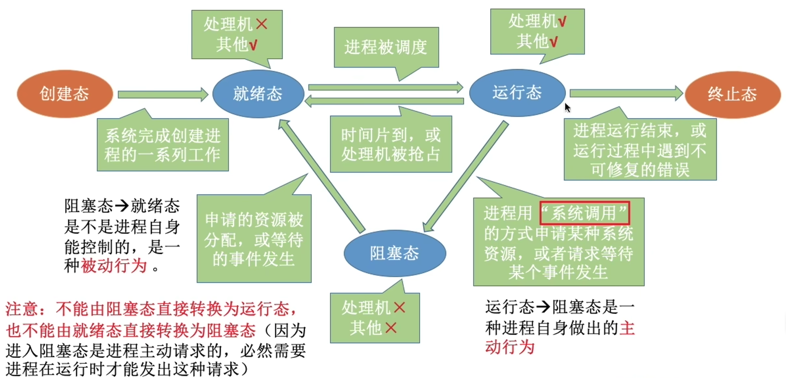
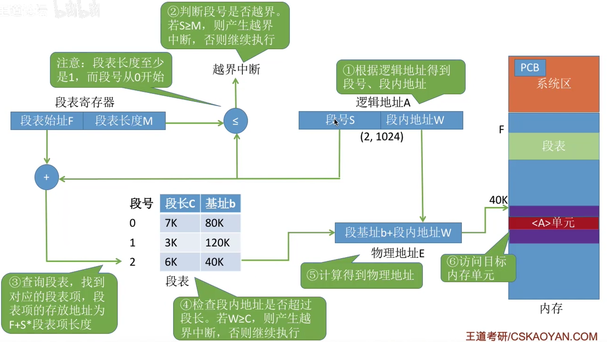

<!-- toc -->

# 第一章 计算机系统概述

## 第一节 操作系统的基本概念

### 操作系统的概念、功能

#### 操作系统的概念

操作系统是指控制和管理整个计算机系统的硬件和软件资源，并合理地组织调度计算机的工作和资源的分配；以提供给用户和其他软件方便的接口和环境；它是计算机系统中最基本的系统软件。

1. 操作系统式系统资源的管理者
2. 操作系统向上层提供方便易用的服务
3. 操作系统是最接近硬件的一层软件

#### 操作系统的功能和目标——作为系统资源的管理者

功能：
1. 处理机管理
2. 存储器管理
3. 文件管理
4. 设备管理

目标：安全、高效

#### 操作系统的功能和目标——向上层提供方便易用的服务

- 直接给用户使用的
	- 图形化用户接口（GUI）
	- 命令接口
		- 联机命令接口，即交互式命令接口
		- 脱机命令接口，即批处理命令接口
- 给软件使用的
	- 程序接口

#### 操作系统的功能和目标——作为最接近硬件的层次·

需要实现对硬件机器的拓展

没有任何软件支持的计算机成为裸机。在裸机上安装的操作系统，可以提供资源管理功能和方便用户的服务功能，将裸机改造成功能更强，使用更方便的机器。

通常把覆盖了软件的机器称为扩充机器，又称之为虚拟机。

### 操作系统的四个特征

#### 操作系统的特征——并发

并发：指两个或多个时间在同一时间间隔内发生。这些时间宏观上是同时发生的，但微观上是交替发生的。

操作系统的并发性指计算机系统中“同时”运行着多个程序，这些程序宏观上看是同时运行着的，而微观上看是交替运行的。

操作系统就是伴随者“多道程序技术”而出现的。因此，操作系统和程序并发是一起诞生的。

注意：
- 单核CPU同一时刻只能执行一个程序，各程序只能并发地执行
- 多核CPU同一时刻可以同时执行多个程序，多个程序可以并行地执行

#### 操作系统的特征——共享

##### 互斥共享方式

系统中的某些资源，虽然可以提供给多个进程使用，但一个时间段内只允许一个进程访问该资源。

##### 同时共享方式

系统中的某些资源，允许一个时间段内由多个进程“同时”对它们进行访问。

#### 并发与共享的关系

- 并发性指计算机系统中同时存在哲多个运行着的程序。
- 共享性指系统中的资源可供内存中多个并发执行的进程共同使用。

并发性与共享性互为存在条件。

#### 操作系统的特征——虚拟

虚拟是指把一个物理上的实体变为若干逻辑上的对应物。物理实体（前者）是实际存在的，而逻辑上对应物（后者）是用户感受到的。

虚拟技术：
- 空分复用技术（如虚拟存储器技术）
- 时分复用技术（如虚拟处理器）

没有并发性，虚拟性也无意义。

#### 操作系统的特征——异步

异步是指在多道程序环境下，允许多个程序并发执行，但由于资源有限，进程的执行不是一贯到底的，而是走走停停，以不可预知的速度向前推进，这就是进程的异步性。

由于并发运行的程序会争抢着使用系统资源，而系统中的资源有限，因此进程的执行不是一贯到底的，而是走走停停的，以不可预知的速度向前推进。

如果失去了并发性，即系统只能串行地运行各个程序，那么每个程序地执行会一贯到底。只有系统拥有并发性，才有可能导致异步性。

## 第二节 操作系统的发展历程

### 操作系统的发展与分类

#### 手工操作阶段

主要缺点：用户独占全机、人机速度矛盾导致资源利用率极低。

#### 批处理阶段——单道批处理系统

引入脱机输入/输出技术，并由监督程序负责控制作业的输入、输出。

主要优点：缓解了一定程度的人机速度矛盾，资源利用率有所提升。

主要缺点：内存中仅能有一道程序运行，只有该程序运行结束以后才能调入下一道程序。CPU有大量的时间实在空闲等待I/O完成。资源利用率依然很低。

#### 批处理阶段——单道批处理系统

每次往内存中读入多道程序，操作系统正式诞生，用于支持多道程序系统并发运行。

主要优点：多道程序并发执行，共享计算机资源。资源利用率大幅提升，CPU和其他资源更能保持“忙碌”状态，系统吞吐量大。

主要缺点：用户响应时间长，没有人机交互功能（用户提交自己作业之后就只能等待计算机处理完成，中间不能控制自己的作业执行）。

#### 分时操作系统

分时操作系统：计算机以时间片为单位轮流为各个用户/作业服务，各个用户可通过终端与计算机进行交互。

主要优点：用户请求可以被及时响应，解决了人机交互问题。允许多个用户同时使用一台计算机，并且用户对计算机的操作相互独立，感受不到别人的存在。

主要缺点：不能优先处理一些紧急任务。操作系统对哥各个用户/作业都是完全公平的，循环地为每个用户/作业服务一个时间片，不区分任务的紧急性。

#### 实时操作系统

主要优点：能够优先响应一些紧急任务，某些紧急任务不需时间片排队。

在实时操作系统的控制下，计算机系统收到外部信号后及时进行处理，并且要在严格的时限内处理完事件。实时操作系统的主要特点是及时性和可靠性。

## 第三节 操作系统的运行环境

### 操作系统的运行机制

#### 内核程序和应用程序

内核是操作系统最重要最核心的部分，也是最接近硬件的部分。

#### 特权指令和非特权指令

- 应用程序只能使用非特权指令
- 操作系统可以执行特权指令

#### 内核态和用户态

CPU中有一个寄存器叫程序状态字寄存器（PSW），其中有个二进制位。1表示“内核态”，0表示“用户态”。

- 处于内核态时，说明此时正在运行的是内核程序，此时可以执行特权指令
- 处于用户态时，说明此时正在运行的是应用程序，此时只能执行非特权指令

内核态->用户态：执行一条特权指令——修改PSW的标志位为“用户态”，这个动作意味着操作系统将主动让出CPU使用权

用户态->内核态：由“中断”引发，硬件自动完成变态过程，触发中断信号意味着操作系统将强行夺回CPU的使用权。

### 中断和异常

#### 中断的作用

在合适的情况下，操作系统内核会把CPU的使用权主动让给应用程序。“中断”是让操作系统内核夺回CPU使用权的唯一途径。

#### 内中断（来自CPU内部，也称异常）

- 试图在用户态下执行特权指令（陷阱，trap）
- 执行除法指令时发现除数为0（故障，fault）
- 有时应用程序想请求操作系统内核的服务，此时会执行一条特殊的指令——陷入指令，该指令会引发一个内部中断信号（终止，abort）

#### 外中断（来自CPU外部，也称中断）

- 时钟中断——由时钟部件发来的中断信号
- I/O中断——由输入/输出设备发来的中断信号

#### 中断机制的基本原理

不同的中断信号，需要不同的中断处理程序来处理。当CPU检测到中断信号后，会根据信号的类型去查询“中断向量表”，以此来找到相应的中断处理程序在内存中存放的位置。

### 系统调用

#### 什么是系统调用

“系统调用”是操作系统提供给应用程序使用的接口，可以理解为一种可供应用程序调用的特殊函数，应用程序可以通过系统调用来请求获得操作系统内核的服务。

#### 系统调用与库函数的区别

| 普通应用程序 | 可直接进行系统调用，也可使用库函数。有的库函数涉及系统调用，有的不涉及             |
| ------ | ----------------------------------------------- |
| 编程语言   | 向上提供库函数。有时会将系统调用封装成库函数，以隐藏系统调用的一些细节，使程序员变成更加方便。 |
| 操作系统   | 向上提供系统调用，使得上层应用程序能请求内核的服务                       |
| 裸机     |                                                 |

#### 用到系统调用的功能

- 设备管理——完成设备的请求/释放/启动等功能
- 文件管理——完成文件的读/写/创建/删除等功能
- 进程控制——完成进程的创建/撤销/阻塞/唤醒等功能
- 进程通信——完成进程之间的消息传递/信号传递等功能
- 内存管理——完成内存的分配/回收等功能

#### 系统调用的过程

1. 传递系统调用参数
2. 执行陷入指令（用户态）
3. 执行相应的内请求核程序处理系统调用（核心态）
4. 返回应用程序

注意：
1. 陷入指令是在用户态下执行的，执行陷入指令之后立即引发一个内中断，使CPU进入核心态
2. 发出系统调用请求是在用户态，而对系统调用的相应处理在核心态下进行

## 第四节 操作系统的体系结构

#### 操作系统的内核

内核是操作系统最基本、最核心的部分。

实现操作系统内核功能的那些程序就是内核程序。

操作系统内核：
- 时钟管理
	- 实现计时功能
- 中断处理
	- 负责实现中断机制
- 原语
	- 是一种特殊的程序
	- 处于操作系统最底层，是最接近硬件的部分
	- 这种程序的运行具有原子性——其运行不可中断
	- 运行时间较短，调用频繁
- 对系统进行管理的功能
	- 进程管理
	- 存储器管理
	- 设备管理

#### 大内核

- 将操作系统的主要功能模块都作为系统内核，运行在核心态
- 优点：高性能
- 缺点：内核代码庞大，结构混乱，难以维护

#### 微内核

- 只把最基本的功能保留在内核
- 
- 优点：内核功能少，结构清晰，方便维护
- 缺点：需要频繁地在核心态和用户态之间切换，性能低

## 第五节 操作系统引导

操作系统引导：
1. CPU从一个特定主存地址开始，取指令，执行ROM中的引导程序（先进行硬件自检，再开机）
2. 将磁盘的第一块——主引导记录读入内存，执行磁盘引导程序，扫描分区表
3. 从活动分区（又称主分区，即安装了操作系统的分区）读入分区引导记录，执行其中的程序
4. 从根目录下找到完整的操作系统初始化程序（即启动管理器）并执行，完成“开机”的一系列动作

## 第六节 虚拟机

#### 虚拟机

虚拟机：使用虚拟化技术，将一台物理机器虚拟化为多台虚拟机器，每个虚拟机器都可以独立运行一个操作系统

# 第二章 进程与线程

## 第一节 进程与线程

### 进程的概念、组成、特征

#### 进程的概念

程序：是静态的，就是存放在磁盘里的可执行文件，就是一系列的指令集合。
进程：是动态地，是程序的一次执行过程。

#### 进程的组成——PCB

PCB是进程存在的唯一标志，当进程被创建时，操作系统为其创建PCB，当进程结束时会回收其PCB。

PCB（Process Control Block）进程控制块：
- 进程描述信息
	- 进程标识符PID
	- 用户标识符UID
- 进程控制和管理信息
	- CPU、磁盘、网络流量使用情况统计...
	- 进程当前状态：就绪态/阻塞态/运行态...
- 资源分配清单
	- 正在使用哪些文件
	- 正在使用哪些区域
	- 正在使用哪些I/O设备
- 处理机相关信息
	- 如PSW、PC等等各种寄存器的值（用于实现进程切换）

#### 进程的组成——程序段、数据段

- 程序段：程序的代码（指令序列）
- 数据段：运行过程中产生的各种数据（如：程序中定义的变量）

#### 进程的组成

- 一个进程实体（进程映像）由PCB、程序段、数据段组成。
- 进程是动态地，进程实体是（进程映像）静态的。
- 进程实体反映了进程在某一时刻的状态。

- 程序段、数据段、PCB三部分组成了进程实体（进程映像）
- 引入进程实体的概念后，可把进程定义为：进程是进程实体的运行过程，是系统进行资源分配和调度的一个独立单位

#### 进程的特征

- 动态性
- 并发性
- 独立性
- 异步性
- 结构性

### 进程的状态与转换

#### 进程的状态——创建态、就绪态

进程正在被创建时，它的状态是“创建态”，在这个阶段操作系统会为进程分配资源、初始化PCB。

当进程创建完成后，便进入“就绪态”，处于就绪态的进程已经具备运行条件，但由于没有空闲CPU，就暂时不能运行。

#### 进程的状态——运行态

如果一个进程此时在CPU上运行，那么这个进程处于“运行态”。

CPU会执行该进程对应的程序（执行指令序列）。

#### 进程的状态——阻塞态

在进程运行的过程中，可能会请求等待某个事件的发生（如等待某种系统资源的分配，或者等待其他进程的响应）。

在这个事件发生之前，进程无法继续往下执行，此时操作系统会让这个进程下CPU，并让它进入“阻塞态”。

当CPU空闲时，又会选择另一个“就绪态”进程上CPU运行。

#### 进程的状态——终止态

一个进程可以执行 exit 系统调用，请求操作系统终止该进程。

此时该进程会进入“终止态”，操作系统会让该进程下CPU，并回收内存空间等资源，最后还要回收该进程的PCB。

当终止进程的工作完成之后，这个进程就彻底消失了。

#### 进程状态的转换

#### 进程的组织——链接方式

- 执行指针——指向当前处于运行态的进程。
	单CPU计算机中，同一时刻只会有一个进程处于运行态。
- 就绪队列指针——指向当前处于就绪态的进程。
	通常会把优先级高的进程放在队头
- 阻塞队列指针——指向当前处于阻塞态的进程
	很多操作系统还会根据阻塞原因不同，再分为多个阻塞队列。

#### 进程的组织——索引方式

根据进程状态的不同，建立几张索引表。

操作系统持有指向各个索引表的指针。

### 进程控制

#### 什么是进程控制

进程控制的主要功能是对系统中的所有进程实施有效的管理，它具有创建新进程、撤销已有进程、实现进程状态转换等功能。

#### 如何实现进程控制

- 用“原语”实现
- 原语的执行具有“原子性”，一气呵成

#### 如何实现原语的“原子性”

原语的执行具有原子性，即执行过程只能一气呵成，期间不允许被中断。

可以用“关中断指令”和“开中断指令”这两个特权指令实现原子性。

CPU执行了关中断指令之后，就不再例行检查中断信号，直到执行开中断信号才会恢复检查。

这样，关中断、开中断之间的这些指令序列就不是可中断的，这就实现了“原子性”。

#### 进程控制相关的原语

进程的创建：
- 创建原语
	- 申请空白PCB
	- 为新进程分配所需资源
	- 初始化PCB
	- 将PCB插入就绪队列
- 引起进程创建的事件
	- 用户登录——分时系统中，用户登陆成功，系统会为其建立一个新的进程
	- 作业调度——多道批处理系统中，有新的作业放入内存时，会为其建立一个新的进程
	- 提供服务——用户向操作系统提出某些请求时，会新建一个进程处理该请求
	- 应用请求——由用户进程主动请求创建一个子进程

进程的终止：
- 撤销原语
	- 从PCB集合中找到终止进程的PCB
	- 若进程正在运行，立即剥夺CPU，将CPu分配给其他进程
	- 终止其所有子进程
	- 将该进程拥有的所有资源归还给父进程或操作系统
	- 删除PCB
- 引起进程终止的事件
	- 正常结束
	- 异常结束
	- 外界干预

进程的阻塞和唤醒：
- 进程的阻塞
	- 阻塞原语
		- 找到要阻塞的进程对应的PCB
		- 保护进程运行现场，将PCB状态信息设置为“阻塞态”，暂时停止进程运行
		- 将PCB插入相应事件的等待队列
	- 引起进程阻塞的事件
		- 需要等待系统分配某种资源
		- 需要等待相互合作的其他进程完成工作
- 进程的唤醒
	- 唤醒原语
		- 在事件等待队列中找到PCB
		- 将PCB从等待队列移除，设置进程为就绪态
		- 将PCB插入就绪队列，等待被调度
	- 引起进程唤醒的事件
		- 等待的事件发生

进程的切换：
- 切换原语
	- 将运行环境信息存入PCB
	- PCB移入相应队列
	- 选择另一个进程执行，并更新其PCB
	- 根据PCB恢复新进程所需的运行环境
- 引起进程切换的事件
	- 当前进程时间片到
	- 有更高优先级的进程到达
	- 当前进程主动阻塞
	- 当前进程终止

各种原语的通用步骤：
1. 更新PCB的信息
2. 将PCB插入合适的队列
3. 分配/回收资源

### 进程通信（IPC）

#### 什么是进程间通信

进程间通信（Inter-Process Communication, IPC）是指两个进程之间产生数据交互。

#### 为什么进程通信需要操作系统支持

进程是分配系统资源的单位（包括内存地址信息），因此各进程拥有的内存地址空间相互独立。

为了保证安全，一个进程不能直接访问另一个进程的地址空间。

#### 进程通信方式——共享存储

- 通过“添加页表项/段表项”即可将同一片共享内存区映射到各个进程的地址空间。
- 为避免出错，各个进程对共享空间的访问应该是互斥的。
- 各个进程可使用操作系统内核提供的同步互斥工具（如P、V操作）。

- 基于存储区的共享：操作系统在内存中划出一块共享存储区，数据的形式、存放位置都由通信进程控制，而不是操作系统。这种共享方式速度很快，是一种高级通信方式。
- 基于数据结构的共享：比如共享空间中直接能放一块长度为10的数组。这种共享方式速度慢、限制多，是一种低级通信方式。

#### 进程通信方式——消息传递

进程间的数据交换以格式化的信息（由消息头和消息体组成）为单位。进程通过操作系统提供的“发送消息/接收消息”两个原语进行数据交换。

直接通信方式：进程P发送原语send(Q, msg)。进程Q接收原语receive(P, &msg)。

间接通信方式：进程P向操作系统申请信箱A，并发送原语send(A, msg)，往信箱A发送消息。进程Q接受原语receive(A, &msg)，从信箱A接收消息。

#### 进程通信方式——管道通信

1. 管道只能采用半双工通信，某一时间段内只能实现单向的传输。如果要实现双向同时通信，则需要设置两个管道。
2. 各进程要互斥地访问管道（由操作系统实现）。
3. 当管道写满时，写进程将阻塞，直到读进程将管道中的数据取走，即可唤醒写进程。
4. 当管道读空时，读进程将阻塞，直到写进程往管道中写入数据，即可唤醒读进程。
5. 管道中的数据一旦被读出，就彻底消失。因此，当多个进程读同一个管道时，可能会错乱。对此，通常有两种解决方案：①一个管道允许多个写进程，一个读进程②允许有多个写进程，多个读进程，但系统会让各个读进程轮流从管道中读数据（Linux 的方案）。

### 线程的概念

#### 什么是线程、为什么引入线程

传统的进程是程序执行流的最小单位。

有的进程可能需要“同时”做很多事，而传统的进程只能串行地执行一系列程序。为此，引入了“线程”，来增加并发度。

- 引入线程后，线程成为了程序执行流的最小单位。可以把线程理解为“轻量级进程”。
- 线程是一个基本的CPU执行单元，也是程序执行流的最小单位。
- 引入线程之后，不仅是进程之间可以并发，进程内的各线程之间也可以并发，从而进一步提升了系统的并发度，使得一个进程内也可以并发处理各种任务（如QQ视频、文字聊天、传文件）
- 引入线程后，进程只作为除CPU之外的系统资源的分配单元（如打印机、内存地址空间等都是分配给进程的）

#### 引入线程带来的变化

- 资源分配、调度：
	- 传统进程机制中，进程是资源分配、调度的基本单位
	- 引入线程后，进程是资源分配的基本单位，线程是调度的基本单位
- 并发性：
	- 传统进程机制中，只能进程间并发
	- 引入线程后，各线程间也能并发，提升了并发度
- 系统开销：
	- 传统的进程间并发，需要切换进程的运行环境，系统开销很大
	- 线程间并发，如果是同一进程内的线程切换，则不需要切换进程环境，系统开销小
	- 引入线程后，并发所带来的系统开销减小

#### 线程的属性

- 线程是处理机调度的单位
- 多CPU计算机中，各个线程可占用不同的CPU
- 每个线程都有一个线程ID、线程控制块 (TCB)
- 线程也有就绪、阻塞、运行三种基本状态
- 线程几乎不拥有系统资源
- 同一进程的不同线程间共享进程的资源
- 由于共享内存地址空间，同一进程中的线程间通信甚至无需系统干预
- 同一进程中的线程切换，不会引起进程切换
- 不同进程中的线程切换，会引起进程切换
- 切换同进程内的线程，系统开销很小
- 切换进程，系统开销较大

### 线程的实现方式和多线程模型

#### 线程的实现方式

用户级线程：
1. 用户级线程由应用程序通过线程库实现，所有的线程管理工作都由应用程序负责（包括线程切换）
2. 用户级线程中，线程切换可以在用户态下即可完成，无需操作系统干预。
3. 在用户看来，是有多个线程。但是在操作系统内核看来，并意识不到线程的存在。就是“从用户视角看能看到“用户级线程”的线程。
4. 优缺点
	- 优点：用户级线程的切换在用户空间即可完成，不需要切换到核心态，线程管理的系统开销小，效率高。
	- 缺点：当一个用户级线程被阻塞后，整个进程都会被阻塞，并发度不高。多个线程不可在多核处理机上并行运行。

内核级线程：
1. 内核级线程的管理工作由操作系统内核完成。
2. 线程调度、切换等工作都由内核负责，因此内核级线程的切换必然需要在核心态下才能完成。
3. 操作系统会为每个内核级线程建立相应的TCB (Thread Control Block，线程控制块)通过TCB对线程进行管理。“内核级线程”就是“从操作系统内核视角看能看到的线程
4. 优缺点
	- 优点：当一个线程被阻塞后，别的线程还可以继续执行，并发能力强。多线程可在多核处理机上并行执行。
	- 缺点：一个用户进程会占用多个内核级线程线程切换由操作系统内核完成，需要切换到核心态，因此线程管理的成本高，开销大。

#### 多线程模型

一对一模型：一个用户级线程映射到一个内核级线程。每个用户进程有与用户级线程同数量的内核级线程。
- 优点：当一个线程被阻塞后，别的线程还可以继续执行，并发能力强。多线程可在多核处理机上并行执行。
- 缺点：一个用户进程会占用多个内核级线程线程切换由操作系统内核完成，需要切换到核心态，因此线程管理的成本高，开销大。

多对一模型:多个用户级线程映射到一个内核级线程。且一个进程只被分配一个内核级线程。
- 优点：用户级线程的切换在用户空间即可完成，不需要切换到核心态，线程管理的系统开销小，效率高。
- 缺点：当一个用户级线程被阻塞后，整个进程都会被阻塞，并发度不高。多个线程不可在多核处理机上并行运行。

多对多模型：n用户及线程映射到m个内核级线程(n>= m)。每个用户进程对应m个内核级线程。
- 克服了多对一模型并发度不高的缺点 (一个阻塞全体阻塞)，又克服了一对一模型中一个用户进程占用太多内核级线程，开销太大的缺点。
- 用户级线程是“代码逻辑”的载体
- 内核级线程是“运行机会”的载体

### 线程的管理

#### 线程的状态与转换

#### 线程的组织与控制

TCB（线程控制块）：
- 线程标识符TID
- 程序计数器PC
- 其他寄存器
- 堆栈指针
- 线程运行状态
- 优先级

可以将多个TCB组织程一张线程表。

## 第二节 处理机调度

### 调度的概念、层次

#### 调度的基本概念

当有一堆任务要处理，但由于资源有限，这些事情没法同时处理。这就需要确定某种规则来决定处理这些任务的顺序，这就是“调度”研究的问题。

#### 调度的三个层次——高级调度

高级调度(作业调度)：按一定的原则从外存的作业后备队列中挑选一个作业调入内存，并创建进程。每个作业只调入一次，调出一次。作业调入时会建立PCB，调出时才撤销PCB。

#### 调度的三个层次——低级调度

- 低级调度 (进程调度/处理机调度)——按照某种策略从就绪队列中选取一个进程，将处理机分配给它。
- 进程调度是操作系统中最基本的一种调度，在一般的操作系统中都必须配置进程调度。
- 进程调度的频率很高，一般几十毫秒一次。

#### 调度的三个层次——中级调度

- 内存不够时，可将某些进程的数据调出外存。等内存空闲或者进程需要运行时再重新调入内存。
- 暂时调到外存等待的进程状态为挂起状态。被挂起的进程PCB会被组织成挂起队列。
- 中级调度(内存调度)——按照某种策略决定将哪个处于挂起状态的进程重新调入内存。
- 一个进程可能会被多次调出、调入内存，因此中级调度发生的频率要比高级调度更高。

#### 进程的挂起态与七状态模型

暂时调到外存等待的进程状态为挂起状态。

挂起态又可以进一步划分为就绪挂起、阻塞挂起两种状态。

#### 三层调度的联系、对比

|            | 调度行为                               | 调度发生位置       | 发生 频率 | 对进程状态的影响            |
| ---------- | ---------------------------------- | ------------ | -------- | ------------------- |
| 高级调度（作业调度） | 按照某种规则，从后备队列中选择合适的作业将其调入内存，并为其创建进程 | 外存->内存（面向作业） | 最低       | 无->创建态->就绪态         |
| 中级调度（内存调度） | 按照某种规则，从挂起队列中选择合适的进程将其数据调回内存       | 外存->内存（面向进程） | 中等       | 阻塞态->就绪态（阻塞挂起->阻塞态） |
| 低级调度（进程调度） | 按照某种规则，从就绪队列中选择一个进程为其分配处理机         | 内存->CPU      | 最高       | 就绪态->运行态            |

### 进程调度的时机、切换与过程、方式

#### 进程调度的时机

进程调度(低级调度)，就是按照某种算法从就绪队列中选择一个进程为其分配处理机。

需要进程调度与切换的情况：
- 当前运行的进程主动放弃处理机
	- 进程正常终止
	- 运行过程中发生异常而中止
	- 进程主动请求阻塞（如：等待I/O）
- 当前运行的进程被动放弃处理机
	- 分给进程的时间片用完
	- 有更紧急的事需要处理（如I/O中断）
	- 有更高优先级的进程进入就绪队列

不能进程调度与切换的情况：
1. 在处理中断的过程中。中断处理过程复杂，与硬件密切相关，很难做到在中断处理过程中进行进程切换。
2. 进程在操作系统内核程序临界区中。
3. 在原子操作过程中(原语) 。原子操作不可中断，要一气呵成（如之前讲过的修改PCB中进程状态标志，并把PCB放到相应队列）。

#### 进程调度的方式

- 非剥夺调度方式，又称非抢占方式。即，只允许进程主动放弃处理机。在运行过程中即便有更紧迫的任务到达，当前进程依然会继续使用处理机，直到该进程终止或主动要求进入阻塞态。
- 剥夺调度方式，又称抢占方式。当一个进程正在处理机上执行时，如果有一个更重要或更紧迫的进程需要使用处理机，则立即暂停正在执行的进程，将处理机分配给更重要紧迫的那个进程。

#### 进程的切换与过程

“狭义的进程调度”与“进程切换”的区别：
- 狭义的进程调度指的是从就绪队列中选中一个要运行的进程。（这个进程可以是刚刚被暂停执行的进程也可能是另一个进程，后一种情况就需要进程切换）
- 进程切换是指一个进程让出处理机，由另一个进程占用处理机的过程。

广义的进程调度包含了选择一个进程和进程切换两个步骤。

进程切换的过程主要完成了:
1. 对原来运行进程各种数据的保存
2. 对新的进程各种数据的恢复（如：程序计数器、程序状态字、各种数据寄存器等处理机现场信息，这些信息一般保存在进程控制块）

注意：进程切换是有代价的，因此如果过于频繁的进行进程调度、切换，必然会使整个系统的效率降低
使系统大部分时间都花在了进程切换上，而真正用于执行进程的时间减少。

### 调度器和闲逛进程

#### 调度器/调度程序(scheduler)

调度时机：
- 创建新进程
- 进程退出
- 运行进程阻塞
- I/0中断发生(可能唤醒某些阻塞进程)

- 非抢占式调度策略，只有运行进程阻塞或退出才触发调度程序工作
- 抢占式调度策略，每个时钟中断或k个时钟中断会触发调度程序工作

#### 闲逛进程

没有就绪进程时，运行闲逛进程。

闲逛进程的特性：
- 优先级最低
- 可以是0地址指令，占一个完整的指令周期（指令周期末尾例行检查中断）
- 能耗低

### 调度算法的评价指标

#### CPU利用率

CPU利用率：指CPU“忙碌”的事件占总时间的比例。

CPU利用率=忙碌时间/总时间

#### 系统吞吐量

系统吞吐量：单位时间内完成作业的数量。

系统吞吐量=总共完成了多少道作业/总共花了多少时间

#### 周转时间

周转时间：是指从作业被提交给系统开始，到作业完成为止的这段时间间隔。

它包括四个部分：
- 作业在外存后备队列上等待作业调度(高级调度)的时间
- 进程在就绪队列上等待进程调度(低级调度)的时间
- 进程在CPU上执行的时间
- 进程等待I/O操作完成的时间

后三项在一个作业的整个处理过程中，可能发生多次。

周转时间=作业完成时间-作业提交时间

平均周转事件=各作业周转时间之和/作业数

带权周转时间=作业周转时间/作业实际运行的事件=（作业完成时间-作业提交时间）/作业实际运行时间

平均带权周转时间=各作业带权周转时间之和/作业数

#### 等待时间

等待时间：指进程/作业处于等待处理机状态时间之和，等待时间越长，用户满意度越低。

对于进程来说，等待时间就是指进程建立后等待被服务的时间之和，在等待I/O完成的期间其实进程也是在被服务的，所以不计入等待时间。

对于作业来说，不仅要考虑建立进程后的等待时间，还要加上作业在外存后备队列中等待的时间。

一个作业总共需要被CPU服务多久，被I/O设备服务多久一般是确定不变的，因此调度算法其实只会影响作业/进程的等待时间。当然，与前面指标类似，也有“平均等待时间”来评价整体性能。

#### 响应时间

响应时间：指从用户提交请求到首次产生相应的时间。

### 调度算法

#### 先来先服务(FCFS, First Come First Serve)

- 算法思想：主要从“公平”的角度考虑。
- 算法规则：按照作业/进程到达的先后顺序进行服务。
- 用于作业/进程调度：用于作业调度时，考虑的是哪个作业先到达后被队列；用于进程调度时，考虑的时哪个进程先到达就绪队列。
- 是否可抢占：非抢占式算法。
- 优缺点：
	- 优点：公平、算法实现简单。
	- 缺点：排在长作业（进程）后面的短作业需要等待很长时间，带权周转时间很大，对短作业来说用户体验不好。即FCFS算法对长作业有利，对短作业不利。
- 是否导致饥饿：不会。

#### 短作业优先(SJF, Shortest Job First)

- 算法思想：追求最少的平均等待时间，最少的平均周转时间、最少的平均平均带权周转时间。
- 算法规则：最短的作业/进程优先得到服务(所谓“最短”，是指要求服务时间最短)。
- 用于作业/进程调度：即可用于作业调度，也可用于进程调度。用于进程调度时称为“短进程优先(SPF shortest Process First) 算法”。
- 是否可抢占：SJF和SPF是非抢占式的算法。但是也有抢占式的版本一一最短剩余时间优先算法。(SRTN,Shortest Remaining Time Next)。
- 优缺点：
	- 优点：“最短的”平均等待时间、平均周转时间。
	- 缺点：不公平。对短作业有利，对长作业不利。可能产生饥饿现象。另外，作业/进程的运行时间是由用户提供的，并不一定真实，不一定能做到真正的短作业优先。
- 是否导致饥饿：会。如果源源不断地有短作业/进程到来，可能使长作业/进程长时间得不到服务，产生“饥饿”现象。如果一直得不到服务，则称为“饿死。

#### 高响应比优先(HRRN, Highest Response Ratio Next)

- 算法思想：要综合考虑作业/进程的等待时间和要求服务的时间。
- 算法规则：在每次调度时先计算各个作业/进程的响应比，选择响应比最高的作业/进程为其服务。相应比=（ 等待时间+要求服务时间）/要求服务时间
- 用于作业/进程调度：即可用于作业调度，也可用于进程调度。
- 是否可抢占：非抢占式的算法。因此只有当前运行的作业/进程主动放弃处理机时，才需要调度，才需要计算响应比。
- 优缺点：
	- 综合考虑了等待时间和运行时间(要求服务时间)。
	- 等待时间相同时，要求服务时间短的优先 (SJF 的优点)。
	- 要求服务时间相同时，等待时间长的优先(FCFS 的优点)。
	- 对于长作业来说，随着等待时间越来越久，其响应比也会越来越大，从而避免了长作业饥饿的问题。
- 是否导致饥饿：不会。

#### 时间片轮转(RR, Round-Robin)

- 算法思想：公平地、轮流地为各个进程服务，让每个进在一定时间间隔内都可以得到响应。
- 算法规则：按照各进程到达就绪队列的顺序，轮流让各个进程执行一个时间片(如100ms)。若进程未在一个时间片内执行完，则剥夺处理机，将进程重新放到就绪队列队尾重新排队。
- 用于作业/进程调度：用于进程调度(只有作业放入内存建立了相应的进程后才能被分配处理机时间片)。
- 是否可抢占：若进程未能在时间片内运行完，将被强行剥夺处理机使用权，因此时间片轮转调度算法属于抢占式的算法。由时钟装置发出时钟中断来通知CPU时间片已到。
- 优缺点：
	- 优点：公平；响应快，适用于分时操作系统。
	- 缺点：由于高频率的进程切换，因此有一定开销；不区分任务的紧急程度。
- 是否导致饥饿：不会。

#### 优先级调度算法

- 算法思想：随着计算机的发展，特别是实时操作系统的出现，越来越多的应用场景需要根据任务的紧急程度来决定处理顺序。
- 算法规则：调度时选择优先级最高的作业/进程。
- 用于作业/进程调度：既可用于作业调度，也可用于进程调度。甚至，还会用于在之后会学习的I/O调度中
- 是否可抢占：抢占式、非抢占式都有。做题时的区别在于：非抢占式只需在进程主动放弃处理机时进行调度即可，而抢占式还需在就绪队列变化时，检查是否会发生抢占。
- 优缺点：
	- 优点：用优先级区分紧急程度、重要程度，适用于实时操作系统。可灵活地调整对各种作业/进程的偏好程度。
	- 缺点：若源源不断地有高优先级进程到来，则可能导致饥饿。
- 是否导致饥饿：会。

#### 多级反馈队列调度算法

- 算法思想：对其他调度算法的折中权衡。
- 算法规则：
	1. 设置多级就绪队列，各级队列优先级从高到低，时间片从小到大。
	2. 新进程到达时先进入第1级队列，按FCFS原则排队等待被分配时间片，若用完时间片进程还未结束，则进程进入下一级队列队尾，如果此时已经是在最下级的队列，则重新放回该队列队尾。
	3. 只有第k级队列为空时，才会为 k+1 级队头的进程分配时间片
- 用于作业/进程调度：用于进程调度。
- 是否可抢占：抢占式的算法。在k级队列的进程运行过程中，若更上级的队列(1~k-1级)中进入了一个新进程，则由于新进程处于优先级更高的队列中，因此新进程会抢占处理机，原来运行的进程放回k级队列队尾。
- 优缺点：
	1. 对各类型进程相对公平(FCFS的优点)；
	2. 每个新到达的进程都可以很快就得到响应 (RR的优点)；
	3. 短进程只用较少的时间就可完成(SPF的优点)；
	4. 不必实现估计进程的运行时间(避免用户作假)；
	5. 可灵活地调整对各类进程的偏好程度，比如CPU密集型进程、I/O密集型进程(拓展:可以将因I/O而阻塞的进程重新放回原队列，这样I/O型进程就可以保持较高优先级)。
- 是否导致饥饿：会。

#### 多级队列调度算法

系统中按进程类型设置多个队列，进程创建成功后插入某个队列：
	1. 系统进程
	2. 交互式进程
	3. 批处理进程

- 队列之间可采取固定优先级，或时间片划分。
- 各队列可采用不同的调度策略，如：系统进程队列采用优先级调度，交互式队列采用RR，批处理队列采用FCFS。

## 第三节 同步与互斥

### 进程同步、进程互斥

#### 进程同步

同步亦称直接制约关系，它是指为完成某种任务而建立的两个或多个进程，这些进程因为需要在某些位置上协调它们的工作次序而产生的制约关系。进程间的直接制约关系就是源于它们之间的相互合作。

#### 进程互斥

我们把一个时间段内只允许一个进程使用的资源称为临界资源。许多物理设备 (比如摄像头、打印机)都属于临界资源。此外还有许多变量、数据、内存缓冲区等都属于临界资源。

对临界资源的访问，必须互斥地进行。互斥，亦称间接制约关系。进程互斥指当一个进程访向某临界资源时，另一个想要访问该临界资源的进程必须等待。当前访问临界资源的进程访问结束，释放该资源之后另一个进程才能去访问临界资源。

为了实现对临界资源的互斥访问，同时保证系统整体性能，需要遵循以下原则:
1. 空闲让进。临界区空闲时，可以允许一个请求进入临界区的进程立即进入临界区。
2. 忙则等待。当已有进程进入临界区时，其他试图进入临界区的进程必须等待。
3. 有限等待。对请求访问的进程，应保证能在有限时间内进入临界区(保证不会饥饿)。
4. 让权等待。当进程不能进入临界区时，应立即释放处理机，防止进程忙等待。

### 进程互斥的软件实现方法

#### 单标志法

算法思想：两个进程在访问完临界区后会把使用临界区的权限转交给另一个进程。也就是说每个进程进入临界区的权限只能被另一个进程赋予。

缺点：只能交替执行，违反“空闲让进”原则。

#### 双标志先检查法

算法思想：设置一个布尔型数组flag[]，数组中各各个元素用来标记各进程想进入临界区的意愿，比如”flag[0]=true“意味着0号进程P0现在想要进入临界区。每个进程在进入临界区之前先检查当前有没有别的进程想进入临界区，如果没有，则把自身对应的标志flag[i]设为true，之后开始访问临界区。

缺点：“检查”和“上锁”两个操作不是一气呵成的，违反“忙则等待”原则。

#### 双标志后检查法

算法思想：双标志先检查法的改版，先“上锁”后“检查”。

缺点：违背了“空闲让进”和“有限等待”原则，会产生“饥饿”现象。

#### Peterson算法

算法思想：结合双标志法、单标志法思想。如果对方都争着想进入临界区，那可以让进程尝试谦让。

缺点：Peterson算法用软件方法解决了进程互斥问题，遵循了空闲让进、忙则等待、有限等待三个原则，但是依然未遵循让权等待的原则。

### 进程互斥的硬件实现方法

#### 中断屏蔽方法

利用“开/关中断指令”实现。

- 优点：简单、高效。
- 缺点：不适用于多处理机；只适合操作系统内核程序，不适合用户进程。

#### TestAndSet指令

TSL指令是用硬件实现的，执行过程中不允许中断，只能一气呵成，边上锁边检查。

- 优点：实现简单，无需像软件实现方法那样严格检查是否会有逻辑漏洞；适用于多处理机环境。
- 缺点：不满足“让权等待”原则，暂时无法进入临界区的进程会占用CPU并循环执行TSL指令，从而导致“忙等”。

#### Swap指令

逻辑上来看 Swap 和 TSL 并无太大区别，都是先记录下此时临界区是否已经被上锁 (记录在 old 变量上)，再将上锁标记lock 设置为 rue，最后检查 od，如果 ld 为false 则说明之前没有别的进程对临界区上锁，则可跳出循环，进入临界区。

- 优点：实现简单，无需像软件实现方法那样严格检查是否会有逻辑漏洞:适用于多处理机环境。
- 缺点：不满足“让权等待”原则，暂时无法进入临界区的进程会占用CPU并循环执行TSL指令，从而导致“忙等”。

### 互斥锁

#### 进程互斥：锁

需要连续循环忙等的互斥锁，都可称为自旋锁，如TSL指令、swap指令、单标志法。

特性：
- 需忙等，进程时间片用完才下处理机，违反“让权等待”。
- 优点：等待期间不用切换进程上下文，多处理器系统中，若上锁的时间短，则等待代价很低。
- 常用于多处理器系统，一个核忙等，其他核照常工作，并快速释放临界区。
- 不太适用于单处理机系统，忙等的过程中不可能解锁。

### 信号量机制

#### 信号量机制

用户进程可以通过使用操作系统提供的一对原语来对信号量进行操作，从而很方便的实现了进程互斥、进程同步。

信号量其实就是一个变量 (可以是一个整数，也可以是更复杂的记录型变量)，可以用一个信号量来表示系统中某种资源的数量，比如: 系统中只有一台打印机，就可以设置一个初值为1的信号量。

原语是一种特殊的程序段，其执行只能一气呵成，不可被中断。原语是由关中断/开中断指令实现的。软件解决方案的主要问题是由“进入区的各种操作无法一气呵成”，因此如果能把进入区、退出区的操作都用“原语”实现，使这些操作能“一气呵成”就能避免问题。

一对原语：wait(S)原语和 signal(S)原语，可以把原语理解为我们自己写的函数，函数名分别为 wait
和 signal，括号里的信号量 S 其实就是函数调用时传入的一个参数。

wait、signal 原语常简称为 P、V操作 (来自荷兰语 proberen 和 verhogen)。因此，做题的时候常把
wait(s)、signal(s)两个操作分别写为 P(S)、V(S)。

#### 整型信号量

用一个整数型的变量作为信号量，用来表示系统中某种资源的数量。

问题：不满足“让权等待”原则，会发生“忙等”。

#### 记录型信号量

整型信号量的缺陷是存在“忙等”问题，因此人们又提出了“记录型信号量”，即用记录型数据结构表示的信号量。

- P(S)，申请资源，资源自减，小于等于则阻塞进程并加入队列
- V(S)，释放资源，资源自增，小于等于零则唤醒队首进程

### 用信号量实现进程互斥、同步、前驱关系

#### 信号量机制实现进程互斥

在临界区前后分别PV：
1. 分析并发进程的关键活动，划定临界区(如: 对临界资源打印机的访问就应放在临界区)
2. 设置互斥信号量 mutex，初值为1
3. 在进入区 P(mutex)一一申请资源
4. 在退出区 V(mutex)——释放资源

注意：对于不同的临界资源要设置不同的互斥信号量；PV操作必须成对进行。

#### 信号量机制实现进程同步

前V后P：
1. 分析什么地方需要实现“同步关系”，即必须保证“一前一后”执的两个操作(两代码)
2. 设置同步信号量 S,初始为 0
3. 在“前操作”之后执行 V(S)
4. 在“后操作”之前执行 P(S)

#### 信号量机制实现前驱关系

每一对前驱关系都是一个进程同步问题(需要保证一前一后的操作)
因此，
1. 要为每一对前驱关系各设置一个同步信号量
2. 在“前操作”之后对相应的同步信号量执行 V 操作
3. 在“后操作”之前对相应的同步信号量执行 P 操作

### 生产者消费者问题

#### 问题描述

- 系统中有一组生产者进程和一组消费者进程，生产者进程每次生产一个产品放入缓冲区，消费者进程每次从缓冲区中取出一个产品并使用。 (注:这里的“产品”理解为某种数据)
- 生产者、消费者共享一个初始为空、大小为n的缓冲区。
- 只有缓冲区没满时，生产者才能把产品放入缓冲区，否则必须等待。
- 只有缓冲区不空时，消费者才能从中取出产品，否则必须等待。
- 缓冲区是临界资源，各进程必须互斥地访问。

#### 分析步骤：
1. 关系分析。找出题目中描述的各个进程，分析它们之间的同步、互斥关系。
2. 整理思路。根据各进程的操作流程确定P、V操作的大致顺序。
3. 设置信号量。并根据题目条件确定信号量初值。 (互斥信号量初值一般为1，同步信号量的初始值要看对应资源的初始值是多少)

- 生产者消费者问题是一个互斥、同步的综合问题。
- 对于初学者来说最难的是发现题目中隐含的两对同步关系。
- 有时候是消费者需要等待生产者生产，有时候是生产者要等待消费者消费，这是两个不同的“一前一后问题”，因此也需要设置两个同步信号量。

易错点：实现互斥和实现同步的两个P操作的先后顺序(死锁问题)。

### 管程

#### 管程的定义和基本特征

管程是一种特殊的软件模块，有这些部分组成:
1. 局部于管程的共享数据结构说明;
2. 对该数据结构进行操作的一组过程;
3. 对局部于管程的共享数据设置初始值的语句;
4. 管程有一个名字。

管程的基本特征：
1. 局部于管程的数据只能被局部于管程的过程所访问；
2. 一个进程只有通过调用管程内的过程才能进入管程访问共享数据；
3. 每次仅允许一个进程在管程内执行某个内部过程。

#### 管程的作用

引入管程的目的无非就是要更方便地实现进程互斥和同步。

1. 需要在管程中定义共享数据(如生产者消费者问题的缓冲区)。
2. 需要在管程中定义用于访问这些共享数据的“入口”——其实就是一些函数(如生产者消费者问题中，可以定义一个函数用于将产品放入缓冲区，再定义一个函数用于从缓冲区取出产品)
3. 只有通过这些特定的“入口”才能访问共享数据。
4. 管程中有很多“入口”，但是每次只能开放其中一个“入口”，并且只能让一个进程或线程进入(如生产者消费者问题中，各进程需要瓦斥地访问共享缓冲区。管程的这种特性即可保证个时间段内最多只会有一个进程在访问缓冲区。注意：这种互斥特性是由编译器负责实现的程序员不用关心)。
5. 可在管程中设置条件变量及等待/唤醒操作以解决同步问题。可以让一个进程或线程在条件变量上等待(此时，该进程应先释放管程的使用权，也就是让出“入口”)；可以通过唤醒操作将等待在条件变量上的进程或线程唤醒。

程序员可以用某种特殊的语法定义一个管程(比如: monitor ProducerConsumer..... end monitor;)“入口”很方便地使用实现进程同步/互斥了。后其他程序员就可以使用这个管程提供的特定

## 第四节 死锁

### 死锁的概念

#### 什么是死锁

在并发环境下，各进程因竞争资源而造成的一种互相等待对方手里的资源，导致各进程都阻塞，都无法向前推
进的现象，就是“死锁”。发生死锁后若无外力干涉，这些进程都将无法向前推进。

#### 死锁、饥饿、死循环的区别

- 死锁：各进程互相等待对方手里的资源，导致各进程都阻塞，无法向前推进的现象。
- 饥饿：由于长期得不到想要的资源，某进程无法向前推进的现象。比如: 在短进程优先 (SPF)算法中，若有源源不断的短进程到来，则长进程将一直得不到处理机，从而发生长进程“饥饿”。
- 死循环：某进程执行过程中一直跳不出某个循环的现象。有时是因为程序逻辑 bug 导致的，有时是程序员故意设计的。

|     |    共同点     | 不同点                                                                                                                                |
| --- | :--------: | ---------------------------------------------------------------------------------------------------------------------------------- |
| 死锁  |            | 死锁一定是“循环等待对方手里的资源”导致的，因此如果有死锁现象，那至少有两个或两个以上的进程同时发生死锁。另外，发生死锁的进程一定处于阻塞态。                                                            |
| 饥饿  | 进程无法顺利向前推进 | 可能只有一个进程发生饥饿。发生饥饿的进程既可能是阻塞态(如长期得不到需要的I/O设备)，也可能是就绪态(长期得不到处理机)                                                                      |
| 死循环 |            | 可能只有一个进程发生死循环。死循环的进程可以上处理机运行(可以是运行态)，只不过无法像期待的那样顺利推进。死锁和饥饿问题是由于操作系统分配资源的策略不合理导致的，而死循环是由代码逻辑的错误导致的。死锁和饥饿是管理者(操作系统) 的问题，死循环是被管理者的问题。 |

#### 死锁产生的必要条件

- 互斥条件：只有对必须互斥使用的资源的争抢才会导致死锁(如哲学家的筷子、打印机设备)。像内存、扬声器这样可以同时让多个进程使用的资源是不会导致死锁的(因为进程不用阻塞等待这种源)。
- 不剥夺条件：进程所获得的资源在未使用完之前，不能由其他进程强行夺走，只能主动释放。
- 请求和保持条件：进程已经保持了至少一个资源，但又提出了新的资源请求，而该资源又被其他进程占有，此时请求进程被阻塞，但又对自己已有的资源保持不放
- 循环等待条件：存在一种进程资源的循环等待链，链中的每一个进程已获得的资源同时被下一个进程所请求。

注意：发生死锁时一定有循环等待，但是发生循环等待时未必死锁(循环等待是死锁的必要不充分条件)。如果同类资源数大于1，则即使有循环等待，也未必发生死锁。但如果系统中每类资源都只有1个，那循环等待就是死锁的充分必要条件了。

#### 什么时候发生死锁

1. 对系统资源的竞争。各进程对不可剥夺的资源(如打印机)的竞争可能引起死锁，对可剥夺的资源 (CPU)的竞争是不会引起死锁的。
2. 进程推进顺序非法。请求和释放资源的顺序不当，也同样会导致死锁。例如，并发执行的进程P1、P2分别申请并占有了资源R1、R2，之后进程P1又紧接着申请资源R2，而进程P2又申请资源R1，两者会因为申请的资源被对方占有而阻塞，从而发生死锁。
3. 信号量的使用不当也会造成死锁。如生产者-消费者问题中，如果实现互斥的P操作在实现同步的P操作之前，就有可能导致死锁。(可以把互斥信号量、同步信号量也看做是一种抽象的系统资源)

总之，对不可剥夺资源的不合理分配，可能导致死锁。

#### 死锁的处理策略

1. 预防死锁。破坏死锁产生的四个必要条件中的一个或几个。
2. 避免死锁。用某种方法防止系统进入不安全状态，从而避免死锁(银行家算法)。
3. 死锁的检测和解除。允许死锁的发生，不过操作系统会负责检测出死锁的发生，然后采取某种措施解除死锁。

### 死锁的处理策略——预防死锁

#### 破坏互斥条件

互斥条件：只有对必须互斥使用的资源的争抢才会导致死锁。

如果把只能互斥使用的资源改造为允许共享使用，则系统不会进入死锁状态。

#### 破坏不可剥夺条件

不剥夺条件：进程所获得的资源在未使用完之前，不能由其他进程强行夺走，只能主动释放。

1. 当某个进程请求新的资源得不到满足时，它必须立即释放保持的所有资源，待以后需要时再重新申请。也就是说，即使某些资源尚未使用完，也需要主动释放，从而破坏了不可剥夺条件。
2. 当某个进程需要的资源被其他进程所占有的时候，可以由操作系统协助，将想要的资源强行剥夺。这种方式一般需要考虑各进程的优先级(比如:剥夺调度方式，就是将处理机资源强行剥夺给优先级更高的进程使用)

该策略的缺点：
1. 实现起来比较复杂。
2. 释放已获得的资源可能造成前一阶段工作的失效。因此这种方法一般只适用于易保存和恢复状态的资源，如CPU。
3. 反复地申请和释放资源会增加系统开销，降低系统吞吐量。
4. 若采用方案一，意味着只要暂时得不到某个资源，之前获得的那些资源就都需要放弃，以后再重新申请。如果一直发生这样的情况，就会导致进程饥饿。

#### 破坏请求和保持条件

请求和保持条件：进程已经保持了至少一个资源，但又提出了新的资源请求，而该资源又被其他进程占有，此时请求进程被阻塞，但又对自己已有的资源保持不放。

可以采用静态分配方法，即进程在运行前一次申请完它所需要的全部资源，在它的资源未满足前，不让它投入运行。一旦投入运行后，这些资源就一直归它所有，该进程就不会再请求别的任何资源。

该策略实现起来简单，但也有明显的缺点:
- 有些资源可能只需要用很短的时间，因此如果进程的整个运行期间都一直保持着所有资源，就会造成严重的资源浪费，资源利用率极低。另外，该策略也有可能导致某些进程饥饿。

#### 破坏循环等待条件

循环等待条件：存在一种进程资源的循环等待链，链中的每一个进程已获得的资源同时被下一个进程所请求。

可采用顺序资源分配法。首先给系统中的资源编号，规定每个进程必须按编号递增的顺序请求资源同类资源 (即编号相同的资源)一次申请完。

原理分析：一个进程只有已占有小编号的资源时，才有资格申请更大编号的资源。按此规则，已持
有大编号资源的进程不可能逆向地回来申请小编号的资源，从而就不会产生循环等待的现象。

该策略的缺点：
1. 不方便增加新的设备，因为可能需要重新分配所有的编号；
2. 进程实际使用资源的顺序可能和编号递增顺序不一致，会导致资源浪费；
3. 必须按规定次序申请资源，用户编程麻烦。

### 死锁的处理策略——避免死锁

#### 银行家算法

核心思想：在进程提出资源申请时，先预判此次分配是否会导致系统进入不安全状态。如果会进入不安全状态，就暂时不答应这次请求，让该进程先阻塞等待。

数据结构：
- 长度为m的一维数组Available 表示还有多少可用资源
- n\*m 矩阵Max表示各进程对资源的最大需求数
- n\*m 矩阵 Allocation 表示已经给各进程分配了多少资源
- Max-Allocation = Need 矩阵表示各进程最多还需要多少资源
- 用长度为m的一位数组 Request 表示进程此次申请的各种资源数

银行家算法步骤：
1. 检查此次申请是否超过了之前声明的最大需求数
2. 检查此时系统剩余的可用资源是否还能满足这次请求
3. 试探着分配，更改各数据结构
4. 用安全性算法检查此次分配是否会导致系统进入不安全状态

安全性算法步骤：
- 检查当前的剩余可用资源是否能满足某个进程的最大需求，如果可以，就把该进程加入安全序列，并把该进程持有的资源全部回收。
- 不断重复上述过程，看最终是否能让所有进程都加入安全序列。

系统处于不安全状态未必死锁，但死锁时一定处于不安全状态。系统处于安全状态一定不会死锁。

### 死锁的处理策略——检测和解除

#### 死锁的检测

为了能对系统是否已发生了死锁进行检测，必须：
1. 用某种数据结构来保存资源的请求和分配信息:
2. 提供一种算法，利用上述信息来检测系统是否已进入死锁状态

- 如果系统中剩余的可用资源数足够满足进程的需求，那么这个进程暂时是不会阻塞的，可以顺利地执行下去。
- 如果这个进程执行结束了把资源归还系统，就可能使某些正在等待资源的进程被激活，并顺利地执行下去。
- 相应的，这些被激活的进程执行完了之后又会归还一些资源，这样可能又会激活另外一些阻塞的进程...

- 如果按上述过程分析，最终能消除所有边，就称这个图是可完全简化的。此时一定没有发生死锁(相当于能找到一个安全序列)
- 如果最终不能消除所有边，那么此时就是发生了死锁
- 最终还连着边的那些进程就是处于死锁状态的进程

#### 死锁的接触

一旦检测出死锁的发生，就应该立即解除死锁。

补充:并不是系统中所有的进程都是死锁状态，用死锁检测算法化简资源分配图后，还连着边的
那些进程就是死锁进程。

解除死锁的主要方法有:
1. 资源剥夺法。挂起(暂时放到外存上) 某些死锁进程，并抢占它的资源，将这些资源分配给其他的死锁进程。但是应防止被挂起的进程长时间得不到资源而饥饿。
2. 撤销进程法(或称终止进程法)。强制撤销部分、甚至全部死锁进程，并剥夺这些进程的资源。这种方式的优点是实现简单，但所付出的代价可能会很大。因为有些进程可能已经运行了很长时间，已经接近结束了，一旦被终止可谓功亏一簧，以后还得从头再来。
3. 进程回退法。让一个或多个死锁进程回退到足以避免死锁的地步。这就要求系统要记录进程设置还原点。的历史信息。

# 第三章 内存管理

## 第一节 内存管理概念

### 内存的基本知识

### 内存管理的基本概念

### 覆盖与交换

#### 覆盖技术

设计思想：将程序分为若干段，常用的段常驻内存，不常用的段在需要时调入内存。即把内存分为一个“固定区”和若干个“覆盖区”，可共享“覆盖区”资源。

缺点：覆盖结构必须由程序员声明，操作系统完成自动覆盖。对用户不透明，增加了用户编程负担。因而只在早期操作系统中使用。

#### 交换技术

设计思想：内存空间紧张时，系统将内存中某些进程暂时换出外存，把外存中某些已具备运行条件的进程换入内存（进程在内存与磁盘间动态调度）。

暂时换出外存等待的进程状态为挂起状态，挂起态可进一步细分为就绪挂起、阻塞挂起两种状态。

1. 具有对换功能的操作系统中，通常把磁盘空间分为文件区和对换区两部分。文件区主要用于存放文件，追求存储空间的利用率，采用离散分配；对换区用于存放主存换出的数据，追求换入换出速度，采用连续分配。
2. 交换通常在许多进程运行且内存吃紧时进行，而系统负荷降低就暂停。
3. 可优先换出阻塞进程；优先级低进程；考虑进程在内存中的驻留时间

（PCB常驻内存不会被换出外存）

### 连续分配管理方式

#### 内存空间的分配与回收

##### 单一连续分配

内存区被分为系统区和用户区。系统区用于存放操作系统，用户区用于存放用户进程相关数据。内存中只能有一道用户程序，用户程序独占整个用户区空间。

优点：实现简单；无外部碎片；可采用覆盖技术扩展内存；不一定采取内存保护
缺点：只能用于单用户、单任务的操作系统中；有内部碎片；存储器利用率极低

##### 固定分区分配

###### 分区大小相等

缺乏灵活性，但适用于一台计算机控制多个相同对象的场合。
###### 分区大小不等

增加了灵活性，可以满足不同大小的进程需求。根据常在系统中运行的作业大小情况进行划分。

操作系统建立分区说明表，来实现各个分区的分配与回收。每个表项对应一个分区，通常按分区大小排列。每个表项包括对应分区的大小、起始地址、状态（是否已分配）。

优点：实现简单，无外部碎片。

缺点：
1. 当用户程序太大时，可能所有的分区都不能满足要求，此时不得不采用覆盖技术来解决，但这又会降低性能。
2. 会产生内部碎片，内存利用率低。

##### 动态分区分配

动态分区分配又称可变分区分配。不会预先划分内存分区，而是在进程装入内存时，根据进程的大小动态地建立分区，并使分区的大小正好适合进程的需要。因此系统分区的大小和数目是可变的。

1. 操作系统通过空闲分区表或空闲分区链记录内存的使用情况。
2. 把一个新作业装入内存时，须按照一定的动态分区分配算法，从空闲分区表或空闲分区链中选出一个分区分配给该作业。
3. 通过空闲分区表或空闲分区链的修改进行分区的分配与回收操作。

### 动态分区分配算法

#### 首次适应算法

算法思想：每次都从低地址开始查找，找到第一个能满足大小的空闲分区。

如何实现：空闲分区以地址递增的次序排列。每次分配内存时顺序查找空闲分区表或空闲分区链，找到大小能满足要求的第一个空闲分区。

#### 最佳适应算法

算法思想：由于动态分区分配是一种连续分配方式，为各进程分配的空间必须是连续的一整片区域。因此为了保证当“大进程”到来睛能有连续的大片空间，可以尽可能多地留下大片的空闲区即，优先使用更小的空闲区。

如何实现：空闲分区按容量递增次序链接。每次分配内存时顺序查找空闲分区链或空闲分区表，找到大小能满足要求的第一个空闲分区。

缺点： 每次都选最小的分区进行分配，会留下越来越多的、很小的、难以利用的内存块。因此这种方法会产生很多的外部碎片。

#### 最坏适应算法

算法思想：为了解决最佳适应算法的问题一一即留下太多难以利用的小碎片，可以在每次分配时优先使用最大的连续空闲区，这样分配后剩余的空闲区就不会太小，更方便使用。

如何实现：空闲分区按容量递减次序链接。每次分配内存时顺序查找空闲分区链(或空闲分区表)，找到大小能满足要求的第一个空闲分区。

缺点：每次都选最大的分区进行分配，虽然可以让分配后留下的空闲区更大，更可用，但是这种方式会导致较大的连续空闲区被迅速用完。如果之后有“大进程”到达，就没有内存分区可用了。

#### 邻近适应算法

算法思想：首次适应算法每次都从链头开始查找的。这可能会导致低地址部分出现很多小的空闲分区，而每次分配查找时，都要经过这些分区，因此也增加了查找的开销。如果每次都从上次查找结束的位置开始检索，就能解决上述问题。

如何实现：空闲分区以地址递增的顺序排列 (可排成一个循环链表)。每次分配内存时从上次查找结束的位置开始查找空闲分区链(或空闲分区表)，找到大小能满足要求的第一个空闲分区。

首次适应算法每次都要从头查找，每次都需要检索低地址的小分区。但是这种规则也决定了当低地址部分有更小的分区可以满足需求时，会更有可能用到低地址部分的小分区，也会更有可能把高地址部分的大分区保留下来(最佳适应算法的优点)。

邻近适应算法的规则可能会导致无论低地址、高地址部分的空闲分区都有相同的概率被使用，也就导致了高地址部分的大分区更可能被使用，划分为小分区，最后导致无大分区可用 (最大适应算法的缺点)。

### 基本分页存储管理的概念

分页存储将内存空间分为若干个大小相等的分区，每个分区是一个“页框”，每个页框有一个编号，即“页框号”。将进程的逻辑地址空间也分为与页匡大小相等的若干部分，每个部分称为一个“页面”，每个页面也有一个编号，即“页号”。

操作系统以页框为单位为各个进程分配内存空间。进程的每个页面分别放入一个页框中。也就是说，进程的页面与内存的页框有一一对应的关系。

#### 每个页表项占多少字节？

为了能知道进程的每个页面在内存中存放的位置，操作系统要为每个进程建立一张页表。页表通常存在PCB(进程控制块)中。

块号根据具体情况计算。

页表项连续存放，因此页号可以是隐含的，不占存储空间。

#### 如何实现地址的转换

特点：虽然进程的各个页面是离散存放的，但是页面内部是连续存放的。

如果要访问逻辑地址 A，则
1. 确定逻辑地址A对应的“页号”P
2. 找到P号页面在内存中的起始地址(需要查页表)
3. 确定逻辑地址A的“页内偏移量”W

逻辑地址A对应的物理地址=P号页面在内存中的起始地址+页内偏移量W

#### 逻辑地址结构

页号 = 逻辑地址/页面长度 (取除法的整数部分)

页内偏移量 = 逻辑地址 %页面长度(取除法的余数部分)

### 基本地址变换机构

基本地址变换机构可以借助进程的页表将逻辑地址转换为物理地址。

通常会在系统中设置一个页表寄存器 (PTR)，存放页表在内存中的起始地址F 和页表长度M。

进程未执行时，页表的始址 和 页表长度 放在进程控制块 (PCB)中，当进程被调度时，操作系统内核会把它们放到页表寄存器中。

注意：页面大小是2的整数幂

设页面大小为 L ，逻辑地址 A 到物理地址 E 的变换过程如下:
1. 计算页号 P 和页内偏移量 W （如果用进制数手算，则 P = A / L，W = A % L：但是在计算机实际运行时，逻辑地址结构是固定不变的，因此计算机硬件可以更快地得到二进制表示的页号、页内偏移量）
2. 比较页号 P 和页表长度 M，若 P >= M，则产生越界中断，否则继续执行。（注意: 页号是从0开始的，而页表长度至少是1，因此 P = M 时也会越界）
3. 页表中页号 P 对应的页表项地址 = 页表起始地址 F + 页号 * 页表项长度，取出该页表项内容 b 即为内存块号。（注意区分页表项长度、页表长度、页面大小的区别。页表长度指的是这个页表中总共有几个页表项，即总共有几个页;页表项长度指的是每个页表项占多大的存储空间;页面大小指的是一个页面占多大的存储空间）
4. 计算 E = b * L + W，用得到的物理地址 E 去访存。（如果内存块号、页面偏移量是用二进制表示的，那么把二者拼接起来就是最终的物理地址了)

在分页存储管理(页式管理)的系统中，只要确定了每个页面的大小，逻辑地址结构就确定了。因此，页式管理中地址是一维的。即，只要给出一个逻辑地址，系统就可以自动地算出页号、页内偏移量 两个部分，并不需要显式地告诉系统这个逻辑地址中，页内偏移量占多少位。

理论上，页表项长度为 3B 即可表示内存块号的范围，但是，为了方便页表的查询，常常会让个页表项占更多的字节，使得每个页面恰好可以装得下整数个页表项。

### 具有快表的地址变换机构

快表，又称联想寄存器 (TLB，translation lookaside buffer)是一种访问速度比内存快很多的高速缓存 (TLB不是内存!)，用来存放最近访问的页表项的副本，可以加速地址变换的速度。与此对应，内存中的页表常称为慢表。

1. CPU给出逻辑地址，由某个硬件算得页号、页内偏移量，将页号与快表中的所有页号进行比较。
2. 如果找到匹配的页号，说明要访问的页表项在快表中有副本，则直接从中取出该页对应的内存块号，再将内存块号与页内偏移量拼接形成物理地址，最后，访问该物理地址对应的内存单元。因此若快表命中，则访问某个逻辑地址仅需一次访存即可。 
3. 如果没有找到匹配的页号，则需要访问内存中的页表，找到对应页表项，得到页面存放的内存块号，再将内存块号与页内偏移量拼接形成物理地址，最后，访问该物理地址对应的内存单元。因此若快表未命中，则访问某个逻辑地址需要两次访存（注意：在找到页表项后，应同时将其存入快表以便后面可能的再次访问。但若快表已满，则必须按照一定的算法对旧的页表项进行替换）

由于查询快表的速度比查询页表的速度快很多，因此只要快表命中，就可以节省很多时间。因为局部性原理，一般来说快表的命中率可以达到 90% 以上。

### 两级页表

#### 单极页表的问题

- 页表必须连续存放，因此当页表很大时，需要占用很多个连续的页框。
- 没有必要让整个页表常驻内存，因为进程在一段时间内可能只需要访问某几个特定的页面。

可将长长的页表进行分组，使每个内存块刚好可以放入一个分组（比如上个例子中，页面大小 4KB，每个页表项4B，每个页面可存放 1K 个页表项，因此每 1K个连续的页表项为一组，每组刚好占一个内存块，再讲各组离散地放到各个内存块中）。

另外，要为离散分配的页表再建立一张页表，称为页目录表，或称外层页表，或称顶层页表。

#### 两级页表的原理、地址结构

#### 如何实现地址变换

#### 需要注意的几个细节

1. 若采用多级页表机制，则各级页表的大小不能超过一个页面
2. 两级页表的访存次数分析（假如没有快表机构）
	第一次访存：访问内存中的页目录表
	第二次访存：访问内存中的二级页表
	第三次访存：访问目标内存单元

### 基本分段存储管理

#### 分段

进程的地址空间:按照程序自身的逻辑关系划分为若干个段，每个段都有一个段名（在低级语言中，程序员使用段名来编程），每段从0开始编址。

内存分配规则：以段为单位进行分配，每个段在内存中占据连续空间，但各段之间可以不相邻。

分段系统的逻辑地址结构由段号 （段名）和段内地址（段内偏移量）所组成。

程序分多个段，各段离散地装入内存，为了保证程序能正常运行，就必须能从物理内存中找到各个逻辑段的存放位置。为此，需为每个进程建立一张段映射表，简称“段表”。

1. 每个段对应一个段表项，其中记录了该段在内存中的起始位置（又称“基址”）和段的长度。
2. 各个段表项的长度是相同的。例如: 某系统按字节寻址，采用分段存储管理，逻辑地址结构为（段号16位，段内地址16位），因此用16位即可表示最大段长。物理内存大小为4GB（可用32位表示整个物理内存地址空间）。因此，可以让每个段表项占16 + 32 = 48位，即6B。由于段表项长度相同，因此段号可以是隐含的，不占存储空间。若段表存放的起始地址为M，则K号段对应的段表项存放的地址为M + K * 6

#### 分段、分页管理的对比

页是信息的物理单位。分页的主要目的是为了实现离散分配，提高内存利用率。分页仅仅是系统管理上的需要，完全是系统行为，对用户是不可见的。

段是信息的逻辑单位。分段的主要目的是更好地满足用户需求。一个段通常包含着一组属于一个逻辑模块的信息。分段对用户是可见的，用户编程时需要显式地给出段名。

页的大小固定且由系统决定。段的长度却不固定，决定于用户编写的程序。

分页的用户进程地址空间是一维的，程序员只需给出一个记忆符即可表示一个地址。

分段的用户进程地址空间是二维的，程序员在标识一个地址时，既要给出段名，也要给出段内地址。

分段比分页更容易实现信息的共享和保护。

不能被修改的代码称为纯代码或可重入代码(不属于临界资源)，这样的代码是可以共享的。可修改的代码是不能共享的(比如，有一个代码段中有很多变量，各进程并发地同时访问可能造成数据不一致）。

### 段页式管理方式

|      | 优点                               | 缺点                                         |
| ---- | -------------------------------- | ------------------------------------------ |
| 分页管理 | 内存空间利用率高，不会产生外部 碎片，只会有少量的页内碎片 | 不方便按照逻辑模块实现信息的共享和保护                        |
| 分段管理 | 很方便按照逻辑模块实现信息的共 享和保护          | 如果段长过大，为其分配很大的连续空间会很不方 便。另外，段式管理会产生外部碎片 |

逻辑地址 = 段号 + 页号 + 页内偏移量

每个段对应一个段表项，每个段表项由段号、页表长度、页表存放块号(页表起始地址) 组成。每个段表项长度相等，段号是隐含的。

每个页面对应一个页表项，每个页表项由页号、页面存放的内存块号组成。每个页表项长度相等，页号是隐含的。

## 第二节 虚拟内存管理

### 虚拟内存管理的基本概念

#### 传统存储管理方式的特征、缺点

一次性:作业必须一次性全部装入内存后才能开始运行。这会造成两个问题：
1. 作业很大时，不能全部装入内存，导致大作业无法运行；
2. 当大量作业要求运行时，由于内存无法容纳所有作业，因此只有少量作业能运行，导致多道程序并发度下降。

驻留性：一旦作业被装入内存，就会一直驻留在内存中，直至作业运行结束。事实上在一个时间段只需要访问作业的一小部分数据即可正常运行，这就导致了内存中会驻留大量的、暂时用不到的数据浪费了宝贵的内存资源。

#### 虚拟内存的定义和特征

基于局部性原理，在程序装入时，可以将程序中很快暂时用不到的部分留在外存会用到的部分装入内存，
就可以让程序开始执行。

在程序执行过程中，当所访问的信息不在内存时，由操作系统负责将所需信息从外存调入内存，然后继续
执行程序。

若内存空间不够，由操作系统负责将内存中暂时用不到的信息换出到外存。

在操作系统的管理下，在用户看来似乎有一个比实际内存大得多的内存，这就是虚拟内存。

虚拟内存有以下三个主要特征：
1. 多次性:无需在作业运行时一次性全部装入内存，而是允许被分成多次调入内存。
2. 对换性:在作业运行时无需一直常驻内存，而是允许在作业运行过程中，将作业换入、换出。
3. 虚拟性:从逻辑上扩充了内存的容量，使用户看到的内存容量，远大于实际的容量

#### 虚拟内存的实现

- 请求分页存储管理
- 请求分段存储管理
- 请求段页式存储管理

主要区别：
在程序执行过程中，当所访问的信息不在内存时，由操作系统负责将所需信息从外存调入内存，然后继续执行程序。
若内存空间不够，由操作系统负责将内存中暂时用不到的信息换出到外存。

### 请求分页管理方式

#### 页表机制

基本分页存储管理的页表结构：页号、内存块号

请求分页存储管理的页表结构：页号、状态位、访问字段、修改位、外存地址

#### 缺页中断机构

在请求分页系统中，每当要访问的页面不在内存时，便产生一个缺页中断，然后由操作系统的缺页中断处理程序处理中断。

此时缺页的进程阻塞，放入阻塞队列，调页完成后再将其唤醒，放回就绪队列。

如果内存中有空闲块，则为进程分配一个空闲块，将所缺页面装入该块，并修改页表中相应的页表项。

如果内存中没有空闲块，则由页面置换算法选择一个页面淘汰，若该页面在内存期间被修改过，则要将其写回外存。未修改过的页面不用写回外存。

#### 地址变换机构

补充细节：
1. 只有“写指令”才需要修改“修改位”。并且，一般来说只需修改快表中的数据，只有要将快表项删除时才需写回内存中的慢表。这样可以减少访存次数。
2. 和普通的中断处理一样，缺页中断处理依然需要保留CPU现场。
3. 需要用某种“页面置换算法”来决定一个换出页面 (下节内容)。
4. 换入/换出页面都需要启动慢速的I/0操作，可见，如果换入换出太频繁，会有很大的开销。
5. 页面调入内存后，需要修改慢表，同时也需要将表项复制到快表中。

### 页面置换算法

#### 最佳置换算法（OPT）

最佳置换算法(OPT，Optimal)： 每次选择淘汰的页面将是以后永不使用，或者在最长时间内不再被访问的页面，这样可以保证最低的缺页率。

最佳置换算法可以保证最低的缺页率，但实际上，只有在进程执行的过程中才能知道接下来会访问到的是哪个页面。操作系统无法提前预判页面访问序列。因此，最佳置换算法是无法实现的。

#### 先进先出置换算法（FIFO）

先进先出置换算法 (FIFO)：每次选择淘汰的页面是最早进入内存的页面。

实现方法：把调入内存的页面根据调入的先后顺序排成一个队列，需要换出页面时选择队头页面即可队列的最大长度取决于系统为进程分配了多少个内存块。

Belady 异常——当为进程分配的物理块数增大时，缺页次数不减反增的异常现象。

只有 FIFO 算法会产生 Belady 异常。另外，FIFO算法虽然实现简单，但是该算法与进程实际运行时的规律不适应，因为先进入的页面也有可能最经常被访问。因此，算法性能较差。

#### 最近最久未使用置换算法（LRU）

最近最久未使用置换算法(LRU，least recentlv used)：每次淘的页面是最近最久未使用的页面

实现方法：赋予每个页面对应的页表项中，用访问字段记录该页面自上次被访问以来所经历的时间t当需要淘汰一个页面时，选择现有页面中t值最大的，即最近最久未使用的页面。

该算法的实现需要专门的硬件支持，虽然算法性能好，但是实现困难，开销大。

#### 时钟置换算法（CLOCK）

最佳置换算法性能最好，但无法实现；先进先出置换算法实现简单，但算法性能差:最近最久未使用置换算法性能好，是最接近OPT算法性能的，但是实现起来需要专门的硬件支持，算法开销大。

时钟置换算法是一种性能和开销较均衡的算法，又称CLOCK算法，或最近未用算法 (NRU，Not Recently Used)。

简单的CLOCK算法实现方法： 为每个页面设置一个访问位，再将内存中的页面都通过链接指针链接成-个循环队列。当某页被访问时，其访问位置为1。当需要淘汰一个页面时，只需检查页的访问位。

如果是0，就选择该页换出；如果是1，则将它置为0，暂不换出，继续检查下一个页面，若第一轮扫描中所有页面都是1，则将这些页面的访问位依次置为0后，再进行第二轮扫描（第二轮扫描中一定会有访问位为0的页面，因此简单的CLOCK 算法选择一个淘汰页面最多会经过两轮扫描）。  

#### 改进型时钟置换算法

简单的时钟置换算法仅考虑到一个页面最近是否被访问过。事实上，如果被淘汰的页面没有被修改过，就不需要执行I/O操作写回外存。只有被淘汰的页面被修改过时，才需要写回外存。

因此，除了考虑一个页面最近有没有被访问过之外，操作系统还应考虑页面有没有被修改过。在其他条件都相同时，应优先淘汰没有修改过的页面，避免/O操作。这就是改进型的时钟置换算法的思想。

修改位=0，表示页面没有被修改过;修改位=1，表示页面被修改过。

为方便讨论，用(访问位，修改位)的形式表示各页面状态。如(1，1)表示一个页面近期被访问过且被修改过。

算法规则:将所有可能被置换的页面排成一个循环队列

- 第一轮：从当前位置开始扫描到第一个 (0,0)的用于替换。本轮扫描不修改任何标志位。（第一优先级：最近没访问，且没修改的页面）
- 第二轮：若第一轮扫描失败，则重新扫描，查找第一个(0,1)的用于替换。本轮将所有扫描过的帧访问位设为0。（第二优先级：最近没访问，但修改过的页面）
- 第三轮：若第二轮扫描失败，则重新扫描，查找第一个(0,0)的用于替换。本轮扫描不修改任何标志位（第三优先级：最近访问过，但没修改的页面）
- 第四轮：若第三轮扫描失败，则重新扫描，查找第一个(0,1)的用于替换。（第四优先级，最近访问过，且修改过的页面）

由于第二轮已将所有帧的访问位设为0，因此经过第三轮、第四轮扫描一定会有一个帧被选中，因此改进型CLOCK置换算法选择一个淘汰页面最多会进行四轮扫描。

### 页面分配策略

#### 页面分配、置换策略

驻留集：指请求分页存储管理中给进程分配的物理块的集合。

在采用了虚拟存储技术的系统中，驻留集大小一般小于进程的总大小。

若驻留集太小，会导致缺页频繁，系统要花大量的时间来处理缺页，实际用于进程推进的时间很少；驻留集太大，又会导致多道程序并发度下降，资源利用率降低。所以应该选择一个合适的驻留集大小。

- 固定分配：操作系统为每个进程分配一组固定数目的物理块，在进程运行期间不再改变。即，驻留集大小不变。
- 可变分配：先为每个进程分配一定数目的物理块，在进程运行期间，可根据情况做适当的增加或减少。即，驻留集大小可变。
- 局部置换：发生缺页时只能选进程自己的物理块进行置换。
- 全局置换：可以将操作系统保留的空闲物理块分配给缺页进程，也可以将别的进程持有的物理块置换到外存，再分配给缺页进程。

- 固定分配局部置换：系统为每个进程分配一定数量的物理块，在整个运行期间都不改变。若进程在运行中发生缺页，则只能从该进程在内存中的页面中选出一页换出，然后再调入需要的页面。这种策略的缺点是。很难在刚开始就确定应为每个进程分配多少个物理块才算合理。 (采用这种策略的系统可以根据进程大小、优先级、或是根据程序员给出的参数来确定为一个进程分配的内存块数)
- 可变分配全局置换：刚开始会为每个进程分配一定数量的物理块。操作系统会保持一个空闲物理块队列。当某进程发生缺页时，从空闲物理块中取出一块分配给该进程:若已无空闲物理块，则可选择一个未锁定的页面换出外存，再将该物理块分配给缺页的进程。采用这种策略时，只要某进程发生缺页都将获得新的物理块，仅当空闲物理块用完时，系统才选择一个未锁定的页面调出。被选择调出的页可能是系统中任何一个进程中的页，因此这个被选中的进程拥有的物理块会减少，缺页率会增加。
- 可变分配局部置换：刚开始会为每个进程分配一定数量的物理块。当某进程发生缺页时，只允许从该进程自己的物理块中选出一个进行换出外存。如果进程在运行中频繁地缺页，系统会为该进程多分配几个物理块，直至该进程缺页率趋势适当程度:反之，如果进程在运行中缺页率特别低，则可适当减少分配给该进程的物理块。

- 可变分配全局置换：只要缺页就给分配新物理块
- 可变分配局部置换：要根据发生缺页的频率来动态地增加或减少进程的物理块

#### 调入页面时机

1. 预调页策略：根据局部性原理，一次调入若干个相邻的页面可能比一次调入一个页面更高效。但如果提前调入的页面中大多数都没被访问过，则又是低效的。因此可以预测不久之后可能访问到的页面，将它们预先调入内存，但目前预测成功率只有50%左右。故这种策略主要用于进程的首次调入。由程序员指出应该先调入哪些部分。
2. 请求调页策略: 进程在运行期间发现缺页时才将所缺页面调入内存。由这种策略调入的页面一定会被访问到，但由于每次只能调入一页，而每次调页都要磁盘I/O操作，因此I/0开销较大。、

#### 调入页面来源

1. 系统拥有足够的对换区空间:页面的调入、调出都是在内存与对换区之间进行，这样可以保证页面的调入、调出速度很快。在进程运行前需将进程相关的数据从文件区复制到对换区.
2. 系统缺少足够的对换区空间:凡是不会被修改的数据都直接从文件区调入，由于这些页面不会被修改，因此换出时不必写回磁盘，下次需要时再从文件区调入即可。对于可能被修改的部分，换出时需写回磁盘对换区，下次需要时再从对换区调入.
3. UNIX 方式：运行之前进程有关的数据全部放在文件区，故未使用过的页面，都可从文件区调若被使用过的页面需要换出，则写回对换入区，卡次需要时从对换区调入。

#### 抖动（颠簸）现象

刚刚换出的页面马上又要换入内存，刚刚换入的页面马上又要换出外存，这种频繁的页面调度行为称为抖动，或颠簸。产生抖动的主要原因是进程频繁访问的页面数目高于可用的物理块数(分配给进程的物理块不够)。

驻留集：指请求分负存储管理中给进程分配的内存块的集合。

工作集：指在某段时间间隔里，进程实际访问页面的集合。

操作系统会根据“窗口尺寸”来算出工作集。

工作集大小可能小于窗口尺寸，实际应用中，操作系统可以统计进程的工作集大小，根据工作集大小给进程分配若干内存块。如:窗口尺寸为5，经过一段时间的监测发现某进程的工作集最大为3，那么说明该进程有很好的局部性，可以给这个进程分配3个以上的内存块即可满足进程的运行需要。

一般来说，驻留集大小不能小于工作集大小，否则进程运行过程中将频繁缺页。

拓展：基于局部性原理可知，进程在一段时间内访问的页面与不久之后会访问的页面是有相关性的。

因此，可以根据进程近期访问的页面集合 (工作集)来设计一种页面置换算法--选择一个不在工作
集中的页面进行淘汰。

### 内存映射文件

#### 传统的文件访问方式

传统的文件访问方式：
- open 系统调用——打开文件
- seek 系统调用——将读写指针移到某个位置
- read 系统调用——从读写指针所指位置读入若干数据(从磁盘读入内存)
- write 系统调用——将内存中的指定数据，写回磁盘(根据读写指针确定要写回什么位置)

#### 内存映射文件（Memory-Mapped Files）

内存映射文件的访问方式:
- open 系统调用--打开文件
- map 系统调用一一将文件映射到进程的虚拟地址空间

- 以访问内存的方式访问文件数据
- 文件数据的读入、写出由操作系统自动完成
- 进程关闭文件时，操作系统自动将文件被修改的数据写回磁盘

多个进程可以映射同一个文件，实现共享。

在物理内存中，一个文件对应同一份数据，当一个进程修改文件数据时，另一个进程可以立马“看到”。
