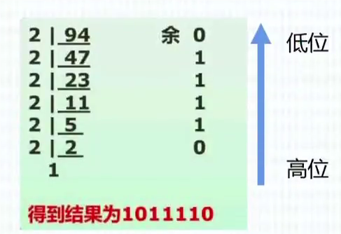
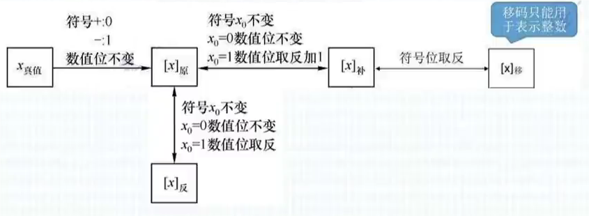
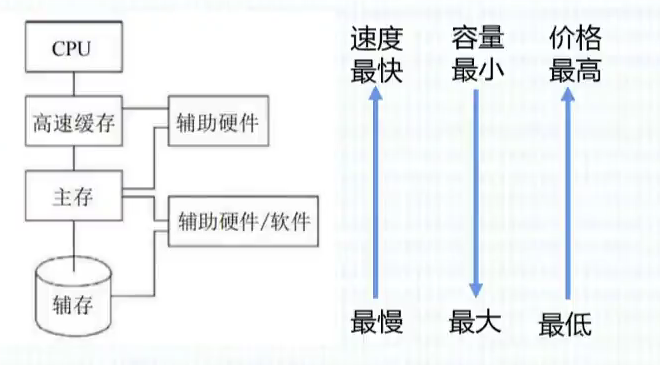

<!-- toc -->

# 1. 数值及其转换和数值的表示

计算机常用进制：
- 二进制(B)
- 八进制(O)
- 十进制(D)
- 十六进制(H)

## 1.1 数值及其转换
### 1.1.1 任意进制转换成十进制

原数的各位乘以相应位权再相加即十进制表示。

### 1.1.2 十进制转换成任意进制

十进制转换成r进制采用短除法，如图所示。

进制转换中，二进制转换为十六进制只需每四位一组，再逐组转换为十六进制即可。

## 1.2 计算机内的数据表示

### 1.2.1 真值与机器数

- 真值：符合人类习惯的数字。
- 机器数：各种数字在计算机中的表示称为机器数，特点是由0、1组成，正负号也需要被“数字化”。机器数包括原码、反码、补码和移码。

### 1.2.2 原码

- 原码：用数值部分表示真值的绝对值，符号位“0/1”对应“正/负”。
- 若机器字长为n+1位，则数值部分（尾数）为n位。
- 原码整数的表示范围：$-(2^n-1)\leq x \leq 2^n-1$
- 真值0有+0和-0两种表示

### 1.2.3 反码

- 反码：若符号位为0，则反码与原码相同；若符号位为1，则原码的数值部分全部取反得到反码（注意反码的符号位始终与原码相同）。
- 若机器字长为n+1位，则数值部分（尾数）为n位。
- 反码整数的表示范围：$-(2^n-1)\leq x \leq 2^n-1$
- 真值0有+0和-0两种表示

### 1.2.4 补码

- 补码：正数的补码与原码和反码都相同；负数的补码即反码的末位加1。
- 补码快速求法：若原码是负数，从右至左扫描原码，遇到的第一个1前的0均可保持不变，后面的数字（除符号位）全部取反。注意此方法不适用于原码的-0。
- 若机器字长为n+1位，则数值部分（尾数）为n位。
- 补码整数的表示范围：$-2^n\leq x \leq 2^n-1$（比原码多表示一个数，$-2^n$）
- 真值0仅有一种表示

### 1.2.5 移码

- 移码：在补码的基础上将符号位取反。
- 若机器字长为n+1位，则数值部分（尾数）为n位。
- 补码整数的表示范围：$-2^n\leq x \leq 2^n-1$（比原码多表示一个数，$-2^n$）
- 真值0仅有一种表示

### 1.2.6 定点数与浮点数

- 定点数：小数点位置固定不变的数。分为定点整数($xxx.0$)和定点小数($0.xxx$)。
- 浮点数：小数点位置不固定的数。由阶符、阶码、数符和尾数组成。
	- 阶码决定浮点数数值范围
	- 尾数决定浮点数数值精度

### 1.2.3 检验码

- 检验码：检验传送的数据是否出错。
- 码距：一个编码系统中任意两个合法编码之间至少有多少个二进制位不同。
- 奇偶校验码：通过在编码中增加一位校验位来使编码中1的个数为奇数(奇校验)或者为偶数(偶校验),从而使码距变为2。对于奇校验，它可以检测代码中奇数位出错的编码，但不能发现偶数位出错的情况，即当合法编码中奇数位发生了错误，也就是编码中的1变成0或0变成1,则该编码中1的个数的奇偶性就发生了变化，从而可以发现错误。
- 循环冗余校验码(CRC)：循环冗余校验码(CRC)广泛应用于数据通信领域和磁介质存储系统中它利用生成多项式为k个数据位产生r个校验位来进行编码，其编码长度为k+r。
- 海明码：在数据为之间插入k个校验码，通过扩大码距来实现检错和纠错。设数据位是n位，校验位是k位，则n和k必须满足$2^k-1\geq n+k$

# 2. 计算机系统组成、指令系统和输入输出技术

## 2.1 计算机系统组成

冯·诺伊曼计算机的特点：
1. 计算机由五大部件组成
2. 指令和数据以同等地位存于存储器，可按地址寻访
3. 指令和数据用二进制表示
4. 指令由操作码和地址码组成
5. 存储程序
6. 以运算器为中心

输入/输出设备与存储器之间的数据传送通过运算器完成。

计算机五大部件：
1. 输入设备：将信息转换为机器能识别的形式
2. 输出设备：将结果转换为人们熟知的形式
3. 主存储器：存放数据和程序
4. 运算器：算术运算、逻辑运算
5. 控制器：指挥各部件，使程序得以运行

### 2.1.1 主存储器

- 存储元：即存储二进制的电子原件，每个存储元可存1bit
- 存储单元：每个存储单元存放一串二进制代码
- 存储字长：存储单元中二进制代码的位数
- MAR：地址寄存器
- MDR：数据寄存器

### 2.1.2 运算器

- 运算器：用于实现算术运算（如:加减乘除）、逻辑运算（如:与或非）
- ACC：累加器，用于存放操作数或运算结果
- MQ：乘商寄存器，在乘、除运算时，用于存放操作数或运算结果
- X：通用的操作数寄存器，用于存放操作数
- ALU：算术逻辑单元，通过内部复杂的电路实现算数运算、逻辑运算
- DR：数据缓存寄存器
- PSW：状态条件寄存器，用来保存指令运行标志

### 2.1.3 控制器

- CU：控制单元，分析指令，给出控制信号
- IR：指令寄存器，存放当前执行的指令
- PC：程序计数器，存放下一条指令地址，有自动加1功能
- AR：地址寄存器，保存当前CPU所访问的内存单元地址
- ID：指令译码器，对操作码进行分析

### 2.1.4 Flynn分类法

| 体系结构类型       | 结构                           | 关键特性                | 代表                        |
| ------------ | ---------------------------- | ------------------- | ------------------------- |
| 单指令流单数据流SISD | 控制部分：一个 处理器：一个 主存模块：一个 |                     | 单处理器系统                    |
| 单指令流多数据流SIMD | 控制部分：一个 处理器：多个 主存模块：多个 | 各处理器以异步的形式处理同一条指令   | 并列处理机 阵列处理机 超级向量处理机 |
| 多指令流单数据流MISD | 控制部分：多个 处理器：一个 主存模块：多个 | 被证明不可能，至少是不实际       |                           |
| 多指令流多数据流MIMD | 控制部分：多个 处理器：多个 主存模块：多个 | 能够实现作业、任务、指令等各级全面并行 | 多处理机系统                 |

## 2.2 指令系统

- 指令(又称机器指令)：是指示计算机执行某种操作的命令，是计算机运行的最小功能单位。
- 一台计算机的所有指令的集合构成该机的指令系统，也称为指令集。
- 一条指令就是机器语言的一个语句，它是一组有意义的二进制代码。
- 一条指令通常要包括操作码字段和地址码字段两部分。

### 2.2.1 寻址方式

1. 立即寻址：操作数作为指令的一部分直接写在指令中，这种操作数称为立即数。
2. 寄存器寻址：指令所要的操作数已存储在某寄存器中，或把目标操作数存入寄存器。
3. 直接寻址：指令所要的操作数存放在内存中，在指令中直接给出该操作数的有效地址。
4. 寄存器间接寻址：操作数在存储器中，操作数的有效地址用S1、DI、BX和BP四个寄存器一来指定。
5. 寄存器相对寻址：操作数在存储器中，其有效地址是一个基址寄存器或变址寄存器中的内容和指令中的8位/16位偏移量之和。
6. 基址加变址寻址方式：操作数在存储器中，其有效地址是一个基址寄存器和一个变址寄存器的内容之和。
7. 相对基址加变址寻址：操作数在存储器中,其有效地址是一个基址寄存器的值、一个变址寄存器的值和指令中的8位/16位偏移量之和。

### 2.2.2 CISC vs RISC

|          | CISC (Complex) | RISC (Reduced)   |
| -------- | -------------- | ---------------- |
| 指令系统     | 复杂、庞大          | 简单、精简            |
| 指令数目     | 一般大于 200 条     | 一般小于 100 条       |
| 指令字长     | 不固定            | 定长               |
| 可访问指令    | 不加限制           | 只有 Load/Store 指令 |
| 各种指令执行时间 | 相差较大           | 绝大多数一个周期内完成      |
| 各种指令使用频度 | 相差较大           | 都比较常用            |
| 通用寄存器数量  | 较少             | 多                |
| 控制方式     | 绝大多数为微程序控制     | 绝大多数为组合逻辑控制      |
| 指令流水线    | 可以通过一定方式实现     | 必须实现             |

### 2.2.3 指令的控制方式

指令控制方式有顺序方式、重叠方式和流水方式三种。

流水线时间的计算：
1. 流水线周期为执行时间最长的一段
2. 流水线计算公式为：一条指令执行时间+(指令条数-1) \* 流水线周期

流水线的吞吐率(Though Put rate, TP)：是指在单位时间内流水线所完成的任务数量或输出得结果数量。

流水线吞吐率的计算：$TP = \frac{指令条数}{流水线执行时间}$

流水线的加速比计算：$S=\frac{不使用流水线执行时间}{使用流水线执行时间}$

## 2.3 输入输出技术

CPU与外设之间的数据传送方式：
1. 直接程序控制方式
	直接程序控制方式是指在完成数据的输入/输出中，整个输入/输出过程是在CPU执行程序的控制下完成的。这种方式还可以分为以下两种：
		(1) 无条件传送方式：无条件地与CPU交换数据。
		(2) 程序查询方式：先通过CPU查询外设状态，准备好之后再与CPU交换数据。
2. 中断方式
	中断方式利用中断机制，使I/O系统在与外设交换数据时，中央处理器无须等待，也不必查询I/O状态，即可以抽身出来处理其他任务，因此提高了系统效率。
3. 直接存储器存取方式
	直接存储器存取(Direct Memory Access,DMA)方式是在存储器与I/O设备间直接传送数据，即在内存与1/0设备之间传送一个数据块的过程中，不需要CPU的任何干涉，是一种完全由DMA硬件完成I/O操作的方式
4. 输入/输出处理机
	输入/输出处理机(IOP)是一个专用处理机，用于完成主机的输入/输出操作。IOP根据主机的 I/O 命令，完成对外设数据的输入/输出。

# 3. 存储系统、总线系统和磁盘阵列技术及可靠性

## 3.1 存储系统

- 主存—辅存：实现虚拟存储系统，解决了主存容量不够的问题，由硬件＋操作系统共同完成。
- Cache—主存：解决了主存与CPU速度不匹配的问题，由硬件自动完成。

### 3.1.1 存储系统的分类

1. **按位置分类**，存储器可分为内存和外存。  
   - **内存（主存）**：用于存储当前运行所需要的程序和数据，具有速度快、容量小的特点。  
   - **外存（辅存）**：用于存储当前不参与运行的数据，容量大但速度相对较慢。
2. **按材料分类**，存储器可分为磁存储器、半导体存储器和光存储器。  
   - **磁存储器**：使用磁性介质制作而成，如磁芯、磁泡、磁盘、磁带等。  
   - **半导体存储器**：  
     - 根据所使用的元件类型可分为双极型和 MOS 型两类。  
     - 根据是否需要刷新，可分为静态存储器（SRAM）和动态存储器（DRAM）两类。  
   - **光存储器**：由光学、电学和机械部件等组成，如光盘存储器。
3. **按可读写特性分类**，存储器可分为读/写存储器和只读存储器。
   - **读/写存储器（RAM）**：可以对数据进行读取和写入操作的存储器。
   - **只读存储器（ROM）**：在工作过程中只能读取数据而不能写入数据的存储器。
   - 根据数据的写入方式，ROM 可分为以下几种类型：
     1. **固定只读存储器（ROM）**：这种存储器是在厂家生产时就将数据写入，其内容只能读取，不能改变。一般用于存放系统程序（如 BIOS）和用于微程序控制。
     2. **可编程的只读存储器（PROM）**：其中的内容可以由用户一次性写入，写入后不能再修改。
     3. **可擦除可编程的只读存储器（EPROM）**：其中的内容可以读出，也可以通过紫外线照射的方式进行擦除，擦除后可以再次写入和修改。
     4. **电擦除可编程的只读存储器（EEPROM）**：与 EPROM 相似，EEPROM 中的内容既可以读出，也可以进行修改。使用电信号而不是紫外线进行数据的擦除和改写。
     5. **闪速存储器（Flash Memory）**：简称闪存。闪存的特性介于 EPROM 和 EEPROM 之间，类似于 EEPROM，可以使用电信号进行信息的擦除和改写操作。整块闪存可以在数秒内完成擦除，速度远快于 EPROM。

### 3.1.2 Cache

**高速缓存（Cache）**是位于 **CPU 和主存之间**的高速存储子系统。

采用**高速缓存**的主要目的是：**提高存储器的平均访问速度**，使存储器的速度与 CPU 的速度相匹配。

Cache 的存在对于程序员来说是透明的。其地址变换和数据块的替换算法均由硬件实现。通常，Cache 被集成到 CPU 内部，以进一步提高访问速度。其主要特点是：**容量小、速度快、成本高**。

Cache 由两部分组成：
1. **存储器部分**：用来存放主存中部分数据的副本信息。
2. **控制部分**：用于判断 CPU 要访问的信息是否在 Cache 中。若存在，则称为命中（Hit）；若不存在，则称为未命中（Miss）。

因为处理机是按主存地址访问的，而数据的读写操作实际上需要通过 Cache 存储器来完成，因此需要将主存中的地址映射到 Cache 存储器中的地址。这种**地址映射**的方法主要有以下三种：
1. **直接映像**：
   - 直接映像的原理是：主存的某个块与 Cache 中的某个块具有固定的对应关系。也就是说，主存中的某个块只能存放在 Cache 中相同块号的位置。
   - 地址映射过程中，如果主存地址中的主存区号与 Cache 中的区号相同，则表明访问命中（Hit）。
   - **优点**：地址变换简单。
   - **缺点**：灵活性差，可能造成频繁的块替换（冲突不命中）。
2. **全相联映像**：
   - 全相联映像允许主存的任意一个块调入 Cache 的任意位置，不存在固定的映射关系。
   - 在地址变换时，将主存地址高位表示的主存块号与 Cache 中的所有主存块号逐一进行比较，如果有相同块号，则表明命中。
   - **优点**：主存的块调入 Cache 的位置不受限制，具有高度灵活性。
   - **缺点**：地址变换复杂，比较操作需要逐一对比，速度相对较慢。
3. **组相联映像**：
   - 组相联映像是一种折中方式，将 Cache 先分组，然后组间采用直接映像方式，而组内采用全相联映像方式。
   - 具体方法是：将 Cache 分为若干组，每组包含若干块。主存的某个块可以映射到某一组的任意块内，但不能映射到其他组中。
   - **优点**：结合了直接映像和全相联映像的优点，既增加了映射的灵活性，又降低了地址变换的复杂度。
   - **缺点**：复杂度和实现难度介于直接映像和全相联映像之间。

**Cache 的性能分析**：
若$H$为 Cache 的命中率，$t_c$为 Cache 的存取时间，$t_m$为主存的访问时间，则 Cache 的等效访问时间为：
$$
t_{avg} = H \cdot t_c + (1 - H) \cdot t_m
$$
使用 Cache 比不使用 Cache 时 CPU 访问存储器的速度提高的倍数 \( r \) 可以用下式求得：
$$
r = \frac{t_m}{t_{avg}}
$$

### 3.1.3 主存的扩展

1. 位扩展（Bit Extension）
	- **概念**：位扩展是通过增加存储器芯片的位数（即每个存储单元的位宽）来扩展主存的容量。
	- **实现方式**：将多个存储芯片按位并行连接，使得系统能够在同一地址下同时访问多个位的数据。例如，若系统中每个存储芯片的数据宽度为 4 位，要将位宽扩展为 8 位，则可以将两个 4 位宽的存储芯片并行连接在一起，这样在同一地址下就能存储 8 位的数据。
	- **应用场景**：适用于提高数据宽度的场合，如将 8 位数据总线扩展到 16 位、32 位等。
	- **优点**：通过增加每个存储单元的位宽，可以提高数据传输的效率。
	- **缺点**：位扩展方式虽然能够提高数据传输效率，但并不会增加存储单元的数量（即存储器的总容量）。
2. 字扩展（Word Extension）
	- **概念**：字扩展是通过增加存储器芯片的字数（即存储单元的个数）来扩展主存的容量。
	- **实现方式**：将多个存储芯片按地址并行连接，使得系统可以存储更多的地址单元。例如，若每个存储芯片有 1024 个存储单元（字），要将存储容量扩展到 2048 个单元，则可以将两个 1024 单元的芯片按地址并行连接在一起，这样地址空间就扩展为 2048 个单元。
	- **应用场景**：适用于增加主存地址空间的场合，如将存储单元从 1KB 扩展到 2KB、4KB 等。
	- **优点**：能够增加存储器的总容量（即更多的地址单元），可以存储更多的数据。
	- **缺点**：虽然可以增加存储容量，但不会改变数据的传输宽度。

### 3.1.4 虚拟存储器

虚拟存储器是由**主存**、**辅存**、**存储管理单元**及**操作系统中的存储管理软件**组成的存储系统。程序在使用该存储系统时，可以使用的内存空间远远大于主存的物理空间，但实际上并不存在那么大的主存空间，因此称其为虚拟存储器。

虚拟存储器使得存储系统既具有类似于外存的容量，又具有接近主存的访问速度。

存取时间 = 寻道时间 + 等待时间（平均定位时间 + 转动延迟）

**注意**：  
- **寻道时间**是指磁头移动到目标磁道所需的时间。  
- **等待时间**为等待读写的扇区转到磁头下方所用的时间。  

## 3.2 总线系统

1. **片内总线（内部总线）**  
	片内总线是指芯片内部的总线，用于连接 CPU 芯片内部的寄存器与寄存器之间、寄存器与 ALU 之间的公共连线。
2. **系统总线**  
	系统总线是计算机系统内各功能部件（如 CPU、主存、I/O 接口）之间相互连接的总线。按系统总线传输信息内容的不同，又可分为三类：  
	- **数据总线**  
	- **地址总线**  
	- **控制总线**
3. **通信总线（外部总线）**  
	用于设备之间的互连，计算机可通过该总线与其他设备进行信息与数据交换。

## 3.3 磁盘阵列技术（RAID）

**冗余磁盘阵列（RAID）** 是一种快速、大容量且高可靠的外存子系统。现在常见的独立冗余磁盘阵列由多台磁盘存储器组成。RAID 技术通过将多块磁盘组成一个冗余阵列来提高存储系统的性能和可靠性。根据不同的实现方式，RAID 技术被划分为多个等级，每个等级提供不同的速度、安全性和性能。常见的 RAID 级别及其说明如下：

| **RAID 级别** | **说明**                                                                                             |
| ----------- | -------------------------------------------------------------------------------------------------- |
| **RAID-0**  | 一种不具备容错能力的磁盘阵列，通过将数据分块存储在多个磁盘上来提高读写速度，但缺乏数据冗余。                                                     |
| **RAID-1**  | 采用镜像（Mirroring）技术来提高可靠性，将每个数据块同时写入两个磁盘中，从而在一个磁盘发生故障时可以使用另一磁盘的数据进行恢复。                               |
| **RAID-2**  | 采用海明码（Hamming Code）进行错误检测和纠正，提供较高的纠错能力，但实现复杂，硬件开销较大，实际应用较少。                                        |
| **RAID-3**  | 采用单独的奇偶校验磁盘（Parity Disk）来存储校验信息，减少了用于校验的磁盘数量，从而提高了阵列的有效容量。一般情况下只有一个校验盘。                            |
| **RAID-4**  | 类似于 RAID-3，但支持独立地对组内各磁盘进行读写操作，仍使用单个校验盘。                                                            |
| **RAID-5**  | 对 RAID-4 的改进，它不设置专门的校验盘，而是将校验信息分散存储在各个磁盘上。同一台磁盘上既记录数据，又记录校验信息，从而避免了磁盘争用校验盘的情况。                     |
| **RAID-6**  | 采用两级数据冗余和新的数据编码技术以解决数据恢复问题。在两个磁盘同时发生故障时仍然能够正常工作。在写操作时，RAID-6 分别进行两次独立的校验运算，生成两个独立的冗余数据，并写入到不同的磁盘中。 |

## 3.4 计算机可靠性

计算机系统的可靠性是指从它开始运行（$t = 0$）到某个时刻$t$这段时间内能够正常运行的概率，用$R(t)$表示。
- **串联部件的可靠度**：等于各部件可靠度的乘积，即：  $R_{\text{串联}} = R_1 \times R_2 \times \cdots \times R_n$
  其中，$R_i$表示第$i$个部件的可靠度。对于串联系统，只要其中一个部件失效，整个系统就会失效，因此串联系统的可靠度较低。
- **并联部件的可靠度**：等于各部件失效概率乘积的补集，即：$R_{\text{并联}} = 1 - (1 - R_1) \times (1 - R_2) \times \cdots \times (1 - R_n)$
  其中，$1 - R_i$ 表示第$i$个部件的失效概率。对于并联系统，只要其中一个部件正常工作，整个系统就可以继续运行，因此并联系统的可靠度较高。
